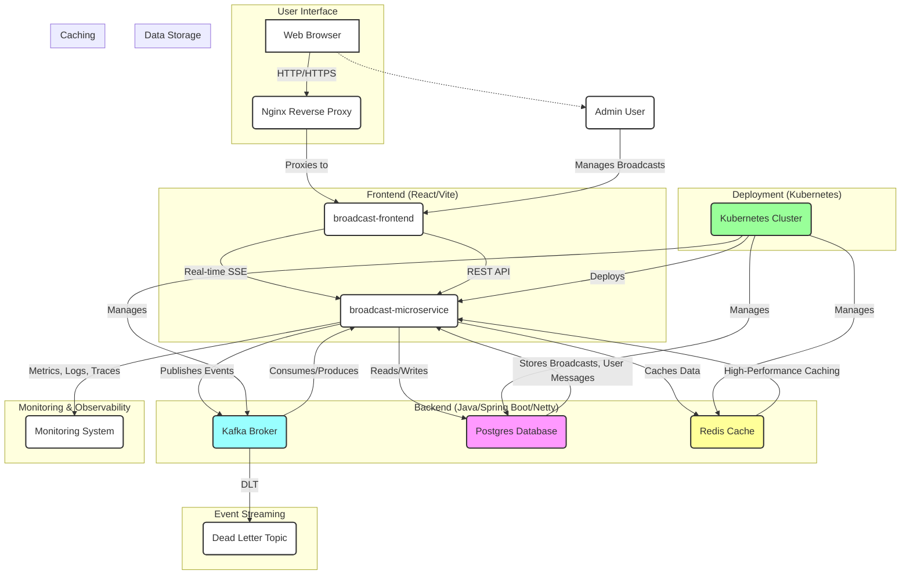

# Broadcast Messaging System

This repository contains a full-stack broadcast messaging system, consisting of a modern React frontend and a high-performance Java microservice.

## Overview

The project is divided into two main components:

-   **[Frontend](./broadcast-frontend/README.md)**: A React application built with Vite, TypeScript, and Tailwind CSS. It provides a user interface for sending and receiving broadcast messages.
-   **[Microservice](./broadcast-microservice/README.md)**: A Java-based microservice built with Spring Boot and Netty. It handles the backend logic, including real-time message delivery via Server-Sent Events (SSE), integration with Kafka, and database management.

For detailed information about each component, please refer to the `README.md` files in their respective directories.

## System Architecture

The overall system architecture is designed for scalability and real-time performance. It includes:

-   **Real-time SSE Delivery**: For instant message delivery to online users.
-   **Event-Driven Architecture**: Using Kafka for asynchronous communication.
-   **High-Performance Caching**: With Redis for low-latency operations.
-   **Scalable Deployment**: Ready for Kubernetes with Horizontal Pod Autoscaling (HPA).

### System Design Diagram

## License

This project is part of the Broadcast Messaging System.
