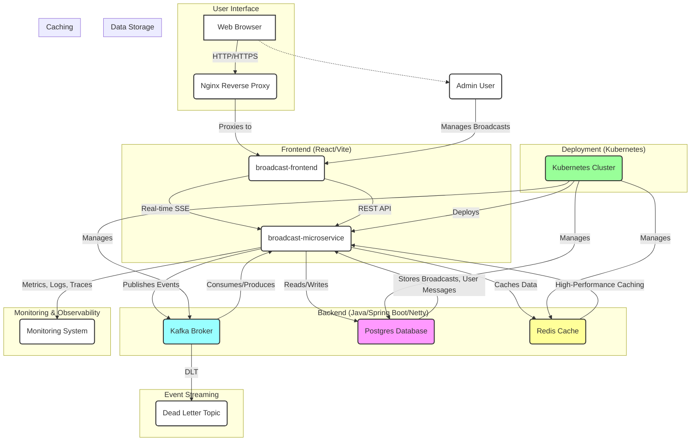
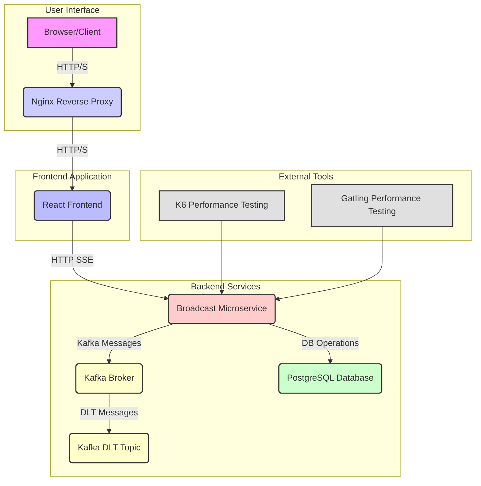

# Broadcast Messaging System

A modern React frontend for the Broadcast Messaging System, built with Vite, TypeScript, and Tailwind CSS.
Backend: Java with Spring Boot and Netty

## Features

- **Real-time Messaging**: Connects to the Java backend via HTTP SSE and `EventSource` for real-time message delivery.
- **Admin Panel**: Create, manage, and monitor broadcast messages, including a panel for Dead Letter Topic (DLT) management.
- **User Panel**: Receive and manage broadcast messages with read/unread status.
- **Modern UI**: Built with shadcn/ui components and Tailwind CSS.
- **Responsive Design**: Works seamlessly on desktop and mobile devices.
- **TypeScript**: Full type safety throughout the application.

### Core Functionality
- **Real-time SSE Delivery**: Sub-second latency for online users
- **Persistent Storage**: h2 Database with admin and user-side tracking
- **Event Streaming**: Kafka-based fan-out with at-least-once semantics
- **High-Performance Caching**: Caffeine for low-latency operations
- **Scalable Architecture**: Kubernetes-ready with HPA and PDB

## Tech Stack

- **React 19**: Latest React with hooks and modern features.
- **Vite**: Fast build tool and development server.
- **TypeScript**: Type-safe JavaScript.
- **Tailwind CSS**: Utility-first CSS framework.
- **shadcn/ui**: High-quality React components.
- **Axios**: HTTP client for API communication.
- **Lucide React**: Beautiful icons.
- **Netty**: High-performance network library for Java.
- **Spring Boot**: Java backend framework.
- **Postgres**: Relational database for message storage.
- **Redis**: In-memory data structure store for caching and message queuing.
- **Docker**: Containerization for easy deployment.
- **Nginx**: Reverse proxy and load balancer.


### Technical Capabilities
- **Reactive Programming**: Spring WebFlux with non-blocking I/O
- **Database Optimization**: Batch operations, proper indexing, connection pooling
- **Message Delivery**: Guaranteed delivery with retry mechanisms
- **Monitoring & Observability**: Comprehensive metrics, logging, and tracing
- **High Availability**: Multi-replica deployment with failover

### Data Flow
1. **Admin creates broadcast** → Stored in h2 DB → Kafka event published
2. **Kafka consumer** processes event → Updates cache → Delivers via SSE
3. **User receives message** → Marks as read → Status updated in DB
4. **Offline users** → Messages cached → Delivered on reconnect


## Prerequisites

- Node.js 18+.
- Java 17+
- Maven 3.6+
- Docker & Kubernetes (for deployment)
- Kafka 3.7.1+ (Confluence 7.7.1)
- Postgres 15+
- Redis 7+

## Database Schema

### Core Tables
- **broadcast_messages**: Admin-side broadcast records
- **user_broadcast_messages**: User-specific delivery tracking
- **user_sessions**: Connection and session management
- **user_preferences**: Notification preferences
- **broadcast_statistics**: Performance metrics
- **dlt_messages**: Dead Letter Topic for failed messages
- **outbox_events**: Outbox table for event sourcing

## Scaling Guide

### Horizontal Scaling
- **Pod Count**: Start with 3, scale to 20+ based on load
- **Resource Allocation**: 3-5GB memory, 1-2 CPU cores per pod
- **Load Balancing**: Kubernetes Service with session affinity

### Vertical Scaling
- **Memory**: Adjust based on cache size requirements
- **CPU**: Scale based on message processing load
- **Network**: Ensure sufficient bandwidth for SSE traffic

### Kafka Scaling
- **Partitions**: 10 partitions for parallel processing
- **Replication**: 3 replicas for fault tolerance
- **Consumer Groups**: Multiple consumers for load distribution

### Actuator
- **Endpoint**: `/actuator/redis-cache-stats`
- **Description**: Provides cache statistics for Redis.
- **Usage**: Access this endpoint to monitor cache performance.
- **Note**: This endpoint is only available when the Redis profile is active.


## Getting Started

1.  **Install dependencies**:
    ```bash
    npm install
    ```

## Project Architecture

2.  **Start the development server**:
    ```bash

     keytool -genkeypair -alias netty -keyalg RSA -keysize 2048 -storetype PKCS12 -keystore broadcast-microservice/src/main/resources/keystore.p12 -validity 3650 -storepass password -keypass password -dname "CN=localhost, OU=IT, O=MyCompany, L=Bangalore, ST=Karnataka, C=IN"

    openssl req -x509 -newkey rsa:2048 -nodes -sha256 -subj '/CN=localhost' -keyout localhost-key.pem -out localhost.pem -days 3650

    npm run dev
    ```

3.  **Open your browser**:
    This will support only max 6 user connections including admin
    Navigate to `https://localhost:3000`

    Navigate to `https://localhost` for ngnix http2 support for more than 6 parellal http connections test from browswer.

## Available Scripts

-   `npm run dev` - Start development server.
-   `npm run build` - Build for production.
-   `npm run preview` - Preview production build.
-   `npm run lint` - Run ESLint.

## H2 Console

- Webflux and h2 console not supporting default by enabling h2 console in application.yml. 
- We need to disable h2 console in application.yml and enable it in H2ConsoleConfig.java.

-   `http://localhost:8083` - H2 Console
-   `jdbc:h2:mem:broadcastdb;DB_CLOSE_DELAY=-1;DB_CLOSE_ON_EXIT=FALSE;MODE=PostgreSQL` - JDBC URL
-   `sa` - Username
-   `password` - Password


## Frontend Project Structure

```
broadcast-frontend/
├── src/
│   ├── components/
│   │   ├── ui/           # shadcn/ui components
│   │   └── broadcast/    # Broadcast-specific components
│   ├── hooks/            # Custom React hooks
│   ├── lib/              # Utility functions and helpers
│   ├── services/         # API service layer
│   ├── utils/            # General utility functions
│   ├── App.tsx           # Main application component
│   ├── main.tsx          # Application entry point
│   └── index.css         # Global styles
│   ├── nginx.conf        # Nginx configuration file
│   ├── localhost.pem     # SSL certificate
│   ├── localhost-key.pem # SSL private key


```

## API Configuration

The frontend is configured to connect to a Java backend:

- **Development**: `https://localhost:8081`

### API Endpoints Used

-   `GET /api/broadcasts` - Get all broadcasts.
-   `POST /api/broadcasts` - Create a new broadcast.
-   `DELETE /api/broadcasts/{id}` - Cancel a broadcast.
-   `GET /api/broadcasts/{id}/stats` - Get broadcast statistics.
-   `GET /api/user/messages` - Get user messages.
-   `POST /api/sse/read` - Mark a message as read.
-   `GET /api/dlt/messages` - Get all messages from the Dead Letter Topic.
-   `POST /api/dlt/redrive/{id}` - Re-process a failed message from the DLT.
-   `DELETE /api/dlt/delete/{id}` - Delete a message from the DLT.
-   `DELETE /api/dlt/purge/{id}` - Permanently purge a message from the DLT and Kafka.


## Components

### BroadcastAdminPanel
- Create new broadcast messages
- Manage existing broadcasts
- View broadcast statistics and delivery details
- Support for scheduled and immediate broadcasts

### BroadcastUserPanel
- Real-time message polling
- Message read/unread status
- Connection management
- Message statistics and filtering

## Environment Variables

Create a `.env` file in the root directory:

```env
VITE_API_BASE_URL=http://localhost:8081
```

## Building for Production

1. **Build the application**:
   ```bash
   npm run build
   ```

2. **Preview the build**:
   ```bash
   npm run preview
   ```

3. **Deploy the `dist` folder** to your web server

## Backend Project Structure

```
broadcast-microservice/
├── KUBERNETES_GUIDE.md
├── k8s/              # Kubernetes deployment configurations
│   ├── base/         # Base Kubernetes manifests
│   └── overlays/     # Environment-specific Kubernetes overlays
├── pom.xml           # Maven project file
└── src/
    ├── main/
    │   ├── java/     # Main Java source code
    │   └── resources/ # Application resources (e.g., application.yml, static files)
    └── test/
        └── scala/    # Test source code (if any Scala tests are present)
```

## Development

### Adding New Components

1. Create new components in `src/components/`
2. Use existing shadcn/ui components as base
3. Follow the established TypeScript patterns
4. Add proper error handling and loading states

### API Integration

1. Add new API methods in `src/services/api.ts`
2. Use proper TypeScript interfaces
3. Handle errors gracefully
4. Add loading states in components

### spring boot profile based start

```bash
mvn spring-boot:run -Dspring-boot.run.profiles=redis
mvn clean package && java "-Dspring.profiles.active=redis" -jar target/broadcast-microservice-1.0.0.jar
```

## Deployment

### Kubernetes Deployment
```bash
# Apply all configurations
kubectl apply -f k8s/

# Verify deployment
kubectl get pods -n broadcast-system
kubectl get hpa -n broadcast-system

### Performance Testing

```bash
k6 run --insecure-skip-tls-verify sse-test.js
mvn gatling:test
```

## Troubleshooting

### Common Issues

1. **CORS Issues**: Ensure your Java backend has proper CORS configuration
2. **Connection Issues**: Verify the Java backend is running on port 8080
3. **Build Errors**: Run `npm install` to ensure all dependencies are installed

### Development Tips

- Use the browser's Network tab to debug API calls
- Check the console for detailed error messages
- Use React DevTools for component debugging

### Startup Tips

- **Redis Profile**: Use `mvn spring-boot:run -Dspring-boot.run.profiles=redis` to start with Redis profile.
- **PostgreSQL Profile**: Use `mvn spring-boot:run -Dspring-boot.run.profiles=dev-pg` to start with PostgreSQL profile.
- **Database Initialization**: For first-time setup, set `spring.sql.init.mode=always` in `application.yml`. After initial schema creation, change to `spring.sql.init.mode=never` and ensure `schema.sql` comment `SET MODE PostgreSQL;` for PostgreSQL then uncomment for h2.

## License

This project is part of the Broadcast Messaging System.

## Project Architecture

### System Design Diagram Backend


### Code Map Backend

```mermaid
graph TD
    subgraph broadcast_frontend_src_App_tsx [src/App.tsx]
        App_tsx_App(App) -- "Uses" --> App_tsx_useBroadcastManagement(useBroadcastManagement)
        App_tsx_App -- "Uses" --> App_tsx_useBroadcastMessages(useBroadcastMessages)
        App_tsx_App -- "Uses" --> App_tsx_useSseConnection(useSseConnection)
        App_tsx_App -- "Renders" --> App_tsx_BroadcastAdminPanel(BroadcastAdminPanel)
        App_tsx_App -- "Renders" --> App_tsx_BroadcastUserPanel(BroadcastUserPanel)
    end

    subgraph broadcast_frontend_src_main_tsx [src/main.tsx]
        main_tsx_main(main) -- "Renders" --> broadcast_frontend_src_App_tsx
    end

    subgraph broadcast_frontend_src_hooks_useBroadcastManagement_ts [src/hooks/useBroadcastManagement.ts]
        useBroadcastManagement_ts_useBroadcastManagement(useBroadcastManagement) -- "Calls" --> broadcast_frontend_src_services_api_ts_api(api)
    end

    subgraph broadcast_frontend_src_hooks_useBroadcastMessages_ts [src/hooks/useBroadcastMessages.ts]
        useBroadcastMessages_ts_useBroadcastMessages(useBroadcastMessages) -- "Calls" --> broadcast_frontend_src_services_api_ts_api(api)
    end

    subgraph broadcast_frontend_src_hooks_useSseConnection_ts [src/hooks/useSseConnection.ts]
        useSseConnection_ts_useSseConnection(useSseConnection) -- "Connects to" --> broadcast_microservice_sse_endpoint(SSE Endpoint)
    end

    subgraph broadcast_frontend_src_services_api_ts [src/services/api.ts]
        api_ts_api(api) -- "Makes HTTP Requests" --> broadcast_microservice_rest_endpoints(REST Endpoints)
    end

    subgraph broadcast_frontend_src_components_broadcast_BroadcastAdminPanel_tsx [src/components/broadcast/BroadcastAdminPanel.tsx]
        BroadcastAdminPanel_tsx_BroadcastAdminPanel(BroadcastAdminPanel) -- "Uses" --> useBroadcastManagement_ts_useBroadcastManagement
        BroadcastAdminPanel_tsx_BroadcastAdminPanel -- "Renders" --> BroadcastCreationForm_tsx_BroadcastCreationForm(BroadcastCreationForm)
        BroadcastAdminPanel_tsx_BroadcastAdminPanel -- "Renders" --> BroadcastManagementList_tsx_BroadcastManagementList(BroadcastManagementList)
        BroadcastAdminPanel_tsx_BroadcastAdminPanel -- "Renders" --> DltManagementPanel_tsx_DltManagementPanel(DltManagementPanel)
    end

    subgraph broadcast_frontend_src_components_broadcast_BroadcastUserPanel_tsx [src/components/broadcast/BroadcastUserPanel.tsx]
        BroadcastUserPanel_tsx_BroadcastUserPanel(BroadcastUserPanel) -- "Uses" --> useBroadcastMessages_ts_useBroadcastMessages
        BroadcastUserPanel_tsx_BroadcastUserPanel -- "Uses" --> useUserPanelManager_ts_useUserPanelManager(useUserPanelManager)
    end

    subgraph broadcast_frontend_src_components_broadcast_BroadcastCreationForm_tsx [src/components/broadcast/BroadcastCreationForm.tsx]
        BroadcastCreationForm_tsx_BroadcastCreationForm(BroadcastCreationForm) -- "Submits to" --> api_ts_api
    end

    subgraph broadcast_frontend_src_components_broadcast_BroadcastManagementList_tsx [src/components/broadcast/BroadcastManagementList.tsx]
        BroadcastManagementList_tsx_BroadcastManagementList(BroadcastManagementList) -- "Manages" --> api_ts_api
    end

    subgraph broadcast_frontend_src_components_broadcast_DltManagementPanel_tsx [src/components/broadcast/DltManagementPanel.tsx]
        DltManagementPanel_tsx_DltManagementPanel(DltManagementPanel) -- "Manages DLT" --> api_ts_api
    end

    subgraph broadcast_frontend_src_hooks_useUserPanelManager_ts [src/hooks/useUserPanelManager.ts]
        useUserPanelManager_ts_useUserPanelManager(useUserPanelManager) -- "Manages User State" --> api_ts_api
    end

    subgraph broadcast_microservice_src_main_java_com_example_controller [broadcast-microservice/src/main/java/com/example/controller]
        Controller_BroadcastController(BroadcastController) -- "Handles" --> broadcast_microservice_rest_endpoints
        Controller_BroadcastController -- "Publishes" --> Kafka_Producer(Kafka Producer)
        Controller_BroadcastController -- "Interacts with" --> Service_BroadcastService(BroadcastService)
    end

    subgraph broadcast_microservice_src_main_java_com_example_service [broadcast-microservice/src/main/java/com/example/service]
        Service_BroadcastService(BroadcastService) -- "Manages Business Logic" --> Repository_BroadcastRepository(BroadcastRepository)
        Service_BroadcastService -- "Sends to" --> Kafka_Producer
        Service_BroadcastService -- "Uses" --> Redis_Cache(Redis Cache)
    end

    subgraph broadcast_microservice_src_main_java_com_example_repository [broadcast-microservice/src/main/java/com/example/repository]
        Repository_BroadcastRepository(BroadcastRepository) -- "Interacts with" --> Postgres_DB(Postgres DB)
    end

    subgraph broadcast_microservice_src_main_java_com_example_kafka [broadcast-microservice/src/main/java/com/example/kafka]
        Kafka_Consumer(Kafka Consumer) -- "Consumes from" --> Kafka_Broker(Kafka Broker)
        Kafka_Consumer -- "Processes" --> Service_BroadcastService
    end

    subgraph broadcast_microservice_src_main_java_com_example_sse [broadcast-microservice/src/main/java/com/example/sse]
        SSE_Handler(SSE Handler) -- "Delivers Events" --> broadcast_microservice_sse_endpoint
        SSE_Handler -- "Uses" --> Service_BroadcastService
    end

    classDef file fill:#fff,stroke:#333,stroke-width:2px;
    classDef component fill:#f9f,stroke:#333,stroke-width:2px;
    classDef hook fill:#ff9,stroke:#333,stroke-width:2px;
    classDef service fill:#9ff,stroke:#333,stroke-width:2px;
    classDef backend_component fill:#cfc,stroke:#333,stroke-width:2px;

    class broadcast_frontend_src_App_tsx file;
    class broadcast_frontend_src_main_tsx file;
    class broadcast_frontend_src_hooks_useBroadcastManagement_ts hook;
    class broadcast_frontend_src_hooks_useBroadcastMessages_ts hook;
    class broadcast_frontend_src_hooks_useSseConnection_ts hook;
    class broadcast_frontend_src_services_api_ts service;
    class broadcast_frontend_src_components_broadcast_BroadcastAdminPanel_tsx component;
    class broadcast_frontend_src_components_broadcast_BroadcastUserPanel_tsx component;
    class broadcast_frontend_src_components_broadcast_BroadcastCreationForm_tsx component;
    class broadcast_frontend_src_components_broadcast_BroadcastManagementList_tsx component;
    class broadcast_frontend_src_components_broadcast_DltManagementPanel_tsx component;
    class broadcast_frontend_src_hooks_useUserPanelManager_ts hook;

    class Controller_BroadcastController backend_component;
    class Service_BroadcastService backend_component;
    class Repository_BroadcastRepository backend_component;
    class Kafka_Consumer backend_component;
    class Kafka_Producer backend_component;
    class SSE_Handler backend_component;

    click broadcast_frontend_src_App_tsx "broadcast-frontend/src/App.tsx"
    click broadcast_frontend_src_main_tsx "broadcast-frontend/src/main.tsx"
    click broadcast_frontend_src_hooks_useBroadcastManagement_ts "broadcast-frontend/src/hooks/useBroadcastManagement.ts"
    click broadcast_frontend_src_hooks_useBroadcastMessages_ts "broadcast-frontend/src/hooks/useBroadcastMessages.ts"
    click broadcast_frontend_src_hooks_useSseConnection_ts "broadcast-frontend/src/hooks/useSseConnection.ts"
    click broadcast_frontend_src_services_api_ts "broadcast-frontend/src/services/api.ts"
    click broadcast_frontend_src_components_broadcast_BroadcastAdminPanel_tsx "broadcast-frontend/src/components/broadcast/BroadcastAdminPanel.tsx"
    click broadcast_frontend_src_components_broadcast_BroadcastUserPanel_tsx "broadcast-frontend/src/components/broadcast/BroadcastUserPanel.tsx"
    click broadcast_frontend_src_components_broadcast_BroadcastCreationForm_tsx "broadcast-frontend/src/components/broadcast/BroadcastCreationForm.tsx"
    click broadcast_frontend_src_components_broadcast_BroadcastManagementList_tsx "broadcast-frontend/src/components/broadcast/BroadcastManagementList.tsx"
    click broadcast_frontend_src_components_broadcast_DltManagementPanel_tsx "broadcast-frontend/src/components/broadcast/DltManagementPanel.tsx"
    click broadcast_frontend_src_hooks_useUserPanelManager_ts "broadcast-frontend/src/hooks/useUserPanelManager.ts"
    click broadcast_microservice_src_main_java_com_example_controller "broadcast-microservice/src/main/java/com/example/controller"
    click broadcast_microservice_src_main_java_com_example_service "broadcast-microservice/src/main/java/com/example/service"
    click broadcast_microservice_src_main_java_com_example_repository "broadcast-microservice/src/main/java/com/example/repository"
    click broadcast_microservice_src_main_java_com_example_kafka "broadcast-microservice/src/main/java/com/example/kafka"
    click broadcast_microservice_src_main_java_com_example_sse "broadcast-microservice/src/main/java/com/example/sse"
```


### System Design Diagram UI


### Code Map

```mermaid
graph TD
    subgraph "https://github.com/rsrini7/Notification-SSE-GLM-Flux/blob/main/src/"
        subgraph "https://github.com/rsrini7/Notification-SSE-GLM-Flux/blob/main/src/App.tsx"
            App_tsx_App[App Component]
            click App_tsx_App "https://github.com/rsrini7/Notification-SSE-GLM-Flux/blob/main/src/App.tsx"
        end

        subgraph "https://github.com/rsrini7/Notification-SSE-GLM-Flux/blob/main/src/main.tsx"
            main_tsx_ReactDOM[ReactDOM.createRoot]
            click main_tsx_ReactDOM "https://github.com/rsrini7/Notification-SSE-GLM-Flux/blob/main/src/main.tsx"
        end

        subgraph "https://github.com/rsrini7/Notification-SSE-GLM-Flux/blob/main/src/services/api.ts"
            api_ts_axios[axios instance]
            api_ts_getBroadcasts[getBroadcasts]
            api_ts_createBroadcast[createBroadcast]
            api_ts_deleteBroadcast[deleteBroadcast]
            api_ts_getBroadcastStats[getBroadcastStats]
            api_ts_getUserMessages[getUserMessages]
            api_ts_markMessageAsRead[markMessageAsRead]
            api_ts_getDltMessages[getDltMessages]
            api_ts_redriveDltMessage[redriveDltMessage]
            api_ts_deleteDltMessage[deleteDltMessage]
            api_ts_purgeDltMessage[purgeDltMessage]
            click api_ts_axios "https://github.com/rsrini7/Notification-SSE-GLM-Flux/blob/main/src/services/api.ts"
        end

        subgraph "https://github.com/rsrini7/Notification-SSE-GLM-Flux/blob/main/src/hooks/useSseConnection.ts"
            useSseConnection_ts_useSseConnection[useSseConnection]
            click useSseConnection_ts_useSseConnection "https://github.com/rsrini7/Notification-SSE-GLM-Flux/blob/main/src/hooks/useSseConnection.ts"
        end

        subgraph "https://github.com/rsrini7/Notification-SSE-GLM-Flux/blob/main/src/hooks/useBroadcastMessages.ts"
            useBroadcastMessages_ts_useBroadcastMessages[useBroadcastMessages]
            click useBroadcastMessages_ts_useBroadcastMessages "https://github.com/rsrini7/Notification-SSE-GLM-Flux/blob/main/src/hooks/useBroadcastMessages.ts"
        end

        subgraph "https://github.com/rsrini7/Notification-SSE-GLM-Flux/blob/main/src/components/broadcast/BroadcastAdminPanel.tsx"
            BroadcastAdminPanel_tsx_BroadcastAdminPanel[BroadcastAdminPanel Component]
            click BroadcastAdminPanel_tsx_BroadcastAdminPanel "https://github.com/rsrini7/Notification-SSE-GLM-Flux/blob/main/src/components/broadcast/BroadcastAdminPanel.tsx"
        end

        subgraph "https://github.com/rsrini7/Notification-SSE-GLM-Flux/blob/main/src/components/broadcast/BroadcastUserPanel.tsx"
            BroadcastUserPanel_tsx_BroadcastUserPanel[BroadcastUserPanel Component]
            click BroadcastUserPanel_tsx_BroadcastUserPanel "https://github.com/rsrini7/Notification-SSE-GLM-Flux/blob/main/src/components/broadcast/BroadcastUserPanel.tsx"
        end

        subgraph "https://github.com/rsrini7/Notification-SSE-GLM-Flux/blob/main/src/components/broadcast/DltManagementPanel.tsx"
            DltManagementPanel_tsx_DltManagementPanel[DltManagementPanel Component]
            click DltManagementPanel_tsx_DltManagementPanel "https://github.com/rsrini7/Notification-SSE-GLM-Flux/blob/main/src/components/broadcast/DltManagementPanel.tsx"
        end

        subgraph "https://github.com/rsrini7/Notification-SSE-GLM-Flux/blob/main/src/lib/utils.ts"
            utils_ts_cn[cn]
            utils_ts_formatDate[formatDate]
            click utils_ts_cn "https://github.com/rsrini7/Notification-SSE-GLM-Flux/blob/main/src/lib/utils.ts"
        end
    end

    main_tsx_ReactDOM --> App_tsx_App

    App_tsx_App --> useSseConnection_ts_useSseConnection
    App_tsx_App --> useBroadcastMessages_ts_useBroadcastMessages
    App_tsx_App --> BroadcastAdminPanel_tsx_BroadcastAdminPanel
    App_tsx_App --> BroadcastUserPanel_tsx_BroadcastUserPanel

    useBroadcastMessages_ts_useBroadcastMessages --> api_ts_getUserMessages
    useBroadcastMessages_ts_useBroadcastMessages --> api_ts_markMessageAsRead

    BroadcastAdminPanel_tsx_BroadcastAdminPanel --> api_ts_getBroadcasts
    BroadcastAdminPanel_tsx_BroadcastAdminPanel --> api_ts_createBroadcast
    BroadcastAdminPanel_tsx_BroadcastAdminPanel --> api_ts_deleteBroadcast
    BroadcastAdminPanel_tsx_BroadcastAdminPanel --> api_ts_getBroadcastStats
    BroadcastAdminPanel_tsx_BroadcastAdminPanel --> DltManagementPanel_tsx_DltManagementPanel

    DltManagementPanel_tsx_DltManagementPanel --> api_ts_getDltMessages
    DltManagementPanel_tsx_DltManagementPanel --> api_ts_redriveDltMessage
    DltManagementPanel_tsx_DltManagementPanel --> api_ts_deleteDltMessage
    DltManagementPanel_tsx_DltManagementPanel --> api_ts_purgeDltMessage

    api_ts_getBroadcasts --> api_ts_axios
    api_ts_createBroadcast --> api_ts_axios
    api_ts_deleteBroadcast --> api_ts_axios
    api_ts_getBroadcastStats --> api_ts_axios
    api_ts_getUserMessages --> api_ts_axios
    api_ts_markMessageAsRead --> api_ts_axios
    api_ts_getDltMessages --> api_ts_axios
    api_ts_redriveDltMessage --> api_ts_axios
    api_ts_deleteDltMessage --> api_ts_axios
    api_ts_purgeDltMessage --> api_ts_axios

    classDef file_node fill:#e0e0e0,stroke:#333,stroke-width:2px;
    classDef component_node fill:#bbf,stroke:#333,stroke-width:2px;
    classDef hook_node fill:#fcc,stroke:#333,stroke-width:2px;
    classDef service_node fill:#cfc,stroke:#333,stroke-width:2px;
    classDef utility_node fill:#ffc,stroke:#333,stroke-width:2px;

    App_tsx_App:::component_node
    main_tsx_ReactDOM:::component_node
    api_ts_axios:::service_node
    api_ts_getBroadcasts:::service_node
    api_ts_createBroadcast:::service_node
    api_ts_deleteBroadcast:::service_node
    api_ts_getBroadcastStats:::service_node
    api_ts_getUserMessages:::service_node
    api_ts_markMessageAsRead:::service_node
    api_ts_getDltMessages:::service_node
    api_ts_redriveDltMessage:::service_node
    api_ts_deleteDltMessage:::service_node
    api_ts_purgeDltMessage:::service_node
    useSseConnection_ts_useSseConnection:::hook_node
    useBroadcastMessages_ts_useBroadcastMessages:::hook_node
    BroadcastAdminPanel_tsx_BroadcastAdminPanel:::component_node
    BroadcastUserPanel_tsx_BroadcastUserPanel:::component_node
    DltManagementPanel_tsx_DltManagementPanel:::component_node
    utils_ts_cn:::utility_node
    utils_ts_formatDate:::utility_node

    style App_tsx_App fill:#bbf,stroke:#333,stroke-width:2px
    style main_tsx_ReactDOM fill:#bbf,stroke:#333,stroke-width:2px
    style api_ts_axios fill:#cfc,stroke:#333,stroke-width:2px
    style api_ts_getBroadcasts fill:#cfc,stroke:#333,stroke-width:2px
    style api_ts_createBroadcast fill:#cfc,stroke:#333,stroke-width:2px
    style api_ts_deleteBroadcast fill:#cfc,stroke:#333,stroke-width:2px
    style api_ts_getBroadcastStats fill:#cfc,stroke:#333,stroke-width:2px
    style api_ts_getUserMessages fill:#cfc,stroke:#333,stroke-width:2px
    style api_ts_markMessageAsRead fill:#cfc,stroke:#333,stroke-width:2px
    style api_ts_getDltMessages fill:#cfc,stroke:#333,stroke-width:2px
    style api_ts_redriveDltMessage fill:#cfc,stroke:#333,stroke-width:2px
    style api_ts_deleteDltMessage fill:#cfc,stroke:#333,stroke-width:2px
    style api_ts_purgeDltMessage fill:#cfc,stroke:#333,stroke-width:2px
    style useSseConnection_ts_useSseConnection fill:#fcc,stroke:#333,stroke-width:2px
    style useBroadcastMessages_ts_useBroadcastMessages fill:#fcc,stroke:#333,stroke-width:2px
    style BroadcastAdminPanel_tsx_BroadcastAdminPanel fill:#bbf,stroke:#333,stroke-width:2px
    style BroadcastUserPanel_tsx_BroadcastUserPanel fill:#bbf,stroke:#333,stroke-width:2px
    style DltManagementPanel_tsx_DltManagementPanel fill:#bbf,stroke:#333,stroke-width:2px
    style utils_ts_cn fill:#ffc,stroke:#333,stroke-width:2px
    style utils_ts_formatDate fill:#ffc,stroke:#333,stroke-width:2px
```
