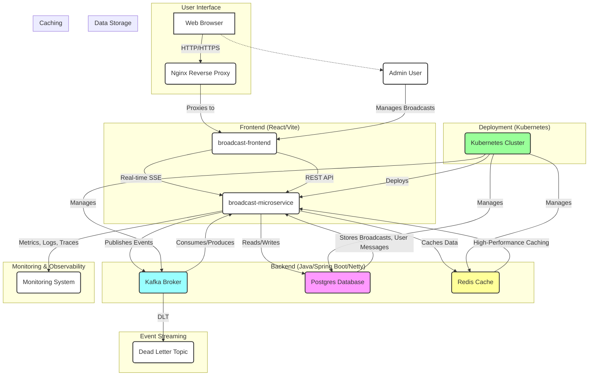

# Broadcast Messaging System - Microservice

A high-performance Java microservice for the Broadcast Messaging System, built with Spring Boot and Netty.

## Features

- **Real-time SSE Delivery**: Sub-second latency for online users
- **Persistent Storage**: h2 Database with admin and user-side tracking
- **Event Streaming**: Kafka-based fan-out with at-least-once semantics
- **High-Performance Caching**: Redis for low-latency operations
- **Scalable Architecture**: Kubernetes-ready with HPA and PDB

## Tech Stack

- **Java 17+**: Backend language.
- **Spring Boot**: Java backend framework.
- **Netty**: High-performance network library for Java.
- **Postgres**: Relational database for message storage.
- **Redis**: In-memory data structure store for caching and message queuing.
- **Docker**: Containerization for easy deployment.
- **Nginx**: Reverse proxy and load balancer.

### Technical Capabilities
- **Reactive Programming**: Spring WebFlux with non-blocking I/O
- **Database Optimization**: Batch operations, proper indexing, connection pooling
- **Message Delivery**: Guaranteed delivery with retry mechanisms
- **Monitoring & Observability**: Comprehensive metrics, logging, and tracing
- **High Availability**: Multi-replica deployment with failover

### Data Flow
1. **Admin creates broadcast** → Stored in h2 DB → Kafka event published
2. **Kafka consumer** processes event → Updates cache → Delivers via SSE
3. **User receives message** → Marks as read → Status updated in DB
4. **Offline users** → Messages cached → Delivered on reconnect

## Prerequisites

- Java 17+
- Maven 3.6+
- Docker & Kubernetes (for deployment)
- Kafka 3.7.1+ (Confluence 7.7.1)
- Postgres 15+
- Redis 7+

## Database Schema

### Core Tables
- **broadcast_messages**: Admin-side broadcast records
- **user_broadcast_messages**: User-specific delivery tracking
- **user_preferences**: Notification preferences
- **broadcast_statistics**: Performance metrics
- **dlt_messages**: Dead Letter Topic for failed messages
- **outbox_events**: Outbox table for event sourcing

## Scaling Guide

### Horizontal Scaling
- **Pod Count**: Start with 3, scale to 20+ based on load
- **Resource Allocation**: 3-5GB memory, 1-2 CPU cores per pod
- **Load Balancing**: Kubernetes Service with session affinity

### Vertical Scaling
- **Memory**: Adjust based on cache size requirements
- **CPU**: Scale based on message processing load
- **Network**: Ensure sufficient bandwidth for SSE traffic

### Kafka Scaling
- **Partitions**: 10 partitions for parallel processing
- **Replication**: 3 replicas for fault tolerance
- **Consumer Groups**: Multiple consumers for load distribution

### Actuator
- **Endpoint**: `/actuator/redis-cache-stats`
- **Description**: Provides cache statistics for Redis.
- **Usage**: Access this endpoint to monitor cache performance.
- **Note**: This endpoint is only available when the Redis profile is active.

## H2 Console

- Webflux and h2 console not supporting default by enabling h2 console in application.yml. 
- We need to disable h2 console in application.yml and enable it in H2ConsoleConfig.java.

-   `http://localhost:8083` - H2 Console
-   `jdbc:h2:mem:broadcastdb;DB_CLOSE_DELAY=-1;DB_CLOSE_ON_EXIT=FALSE;MODE=PostgreSQL` - JDBC URL
-   `sa` - Username
-   `password` - Password

## Backend Project Structure

```
broadcast-microservice/
├── KUBERNETES_GUIDE.md
├── k8s/              # Kubernetes deployment configurations
│   ├── base/         # Base Kubernetes manifests
│   └── overlays/     # Environment-specific Kubernetes overlays
├── pom.xml           # Maven project file
└── src/
    ├── main/
    │   ├── java/     # Main Java source code
    │   └── resources/ # Application resources (e.g., application.yml, static files)
    └── test/
        └── scala/    # Test source code (if any Scala tests are present)
```

## Development

### spring boot profile based start

```bash
# Generate SSL keystore for the microservice
keytool -genkeypair -alias netty -keyalg RSA -keysize 2048 -storetype PKCS12 -keystore broadcast-microservice/src/main/resources/keystore.p12 -validity 3650 -storepass password -keypass password -dname "CN=localhost, OU=IT, O=MyCompany, L=Bangalore, ST=Karnataka, C=IN"

# Start with Redis profile
mvn spring-boot:run -Dspring-boot.run.profiles=redis

# Build and run with Redis profile
mvn clean package && java "-Dspring.profiles.active=redis" -jar target/broadcast-microservice-1.0.0.jar
```

## Deployment

### Kubernetes Deployment
```bash
# Apply all configurations
kubectl apply -f k8s/

# Verify deployment
kubectl get pods -n broadcast-system
kubectl get hpa -n broadcast-system
```

### Performance Testing

```bash
k6 run --insecure-skip-tls-verify sse-test.js
mvn gatling:test
```

## Troubleshooting

### Startup Tips

- **Redis Profile**: Use `mvn spring-boot:run -Dspring-boot.run.profiles=redis` to start with Redis profile.
- **PostgreSQL Profile**: Use `mvn spring-boot:run -Dspring-boot.run.profiles=dev-pg` to start with PostgreSQL profile.
- **Database Initialization**: For first-time setup, set `spring.sql.init.mode=always` in `application.yml`. After initial schema creation, change to `spring.sql.init.mode=never` and ensure `schema.sql` comment `SET MODE PostgreSQL;` for PostgreSQL then uncomment for h2.

## Project Architecture

### System Design Diagram Backend


### Code Map Backend

```mermaid
graph TD
    subgraph broadcast_frontend_src_App_tsx [src/App.tsx]
        App_tsx_App(App) -- "Uses" --> App_tsx_useBroadcastManagement(useBroadcastManagement)
        App_tsx_App -- "Uses" --> App_tsx_useBroadcastMessages(useBroadcastMessages)
        App_tsx_App -- "Uses" --> App_tsx_useSseConnection(useSseConnection)
        App_tsx_App -- "Renders" --> App_tsx_BroadcastAdminPanel(BroadcastAdminPanel)
        App_tsx_App -- "Renders" --> App_tsx_BroadcastUserPanel(BroadcastUserPanel)
    end

    subgraph broadcast_frontend_src_main_tsx [src/main.tsx]
        main_tsx_main(main) -- "Renders" --> broadcast_frontend_src_App_tsx
    end

    subgraph broadcast_frontend_src_hooks_useBroadcastManagement_ts [src/hooks/useBroadcastManagement.ts]
        useBroadcastManagement_ts_useBroadcastManagement(useBroadcastManagement) -- "Calls" --> broadcast_frontend_src_services_api_ts_api(api)
    end

    subgraph broadcast_frontend_src_hooks_useBroadcastMessages_ts [src/hooks/useBroadcastMessages.ts]
        useBroadcastMessages_ts_useBroadcastMessages(useBroadcastMessages) -- "Calls" --> broadcast_frontend_src_services_api_ts_api(api)
    end

    subgraph broadcast_frontend_src_hooks_useSseConnection_ts [src/hooks/useSseConnection.ts]
        useSseConnection_ts_useSseConnection(useSseConnection) -- "Connects to" --> broadcast_microservice_sse_endpoint(SSE Endpoint)
    end

    subgraph broadcast_frontend_src_services_api_ts [src/services/api.ts]
        api_ts_api(api) -- "Makes HTTP Requests" --> broadcast_microservice_rest_endpoints(REST Endpoints)
    end

    subgraph broadcast_frontend_src_components_broadcast_BroadcastAdminPanel_tsx [src/components/broadcast/BroadcastAdminPanel.tsx]
        BroadcastAdminPanel_tsx_BroadcastAdminPanel(BroadcastAdminPanel) -- "Uses" --> useBroadcastManagement_ts_useBroadcastManagement
        BroadcastAdminPanel_tsx_BroadcastAdminPanel -- "Renders" --> BroadcastCreationForm_tsx_BroadcastCreationForm(BroadcastCreationForm)
        BroadcastAdminPanel_tsx_BroadcastAdminPanel -- "Renders" --> BroadcastManagementList_tsx_BroadcastManagementList(BroadcastManagementList)
        BroadcastAdminPanel_tsx_BroadcastAdminPanel -- "Renders" --> DltManagementPanel_tsx_DltManagementPanel(DltManagementPanel)
    end

    subgraph broadcast_frontend_src_components_broadcast_BroadcastUserPanel_tsx [src/components/broadcast/BroadcastUserPanel.tsx]
        BroadcastUserPanel_tsx_BroadcastUserPanel(BroadcastUserPanel) -- "Uses" --> useBroadcastMessages_ts_useBroadcastMessages
        BroadcastUserPanel_tsx_BroadcastUserPanel -- "Uses" --> useUserPanelManager_ts_useUserPanelManager(useUserPanelManager)
    end

    subgraph broadcast_frontend_src_components_broadcast_BroadcastCreationForm_tsx [src/components/broadcast/BroadcastCreationForm.tsx]
        BroadcastCreationForm_tsx_BroadcastCreationForm(BroadcastCreationForm) -- "Submits to" --> api_ts_api
    end

    subgraph broadcast_frontend_src_components_broadcast_BroadcastManagementList_tsx [src/components/broadcast/BroadcastManagementList.tsx]
        BroadcastManagementList_tsx_BroadcastManagementList(BroadcastManagementList) -- "Manages" --> api_ts_api
    end

    subgraph broadcast_frontend_src_components_broadcast_DltManagementPanel_tsx [src/components/broadcast/DltManagementPanel.tsx]
        DltManagementPanel_tsx_DltManagementPanel(DltManagementPanel) -- "Manages DLT" --> api_ts_api
    end

    subgraph broadcast_frontend_src_hooks_useUserPanelManager_ts [src/hooks/useUserPanelManager.ts]
        useUserPanelManager_ts_useUserPanelManager(useUserPanelManager) -- "Manages User State" --> api_ts_api
    end

    subgraph broadcast_microservice_src_main_java_com_example_controller [broadcast-microservice/src/main/java/com/example/controller]
        Controller_BroadcastController(BroadcastController) -- "Handles" --> broadcast_microservice_rest_endpoints
        Controller_BroadcastController -- "Publishes" --> Kafka_Producer(Kafka Producer)
        Controller_BroadcastController -- "Interacts with" --> Service_BroadcastService(BroadcastService)
    end

    subgraph broadcast_microservice_src_main_java_com_example_service [broadcast-microservice/src/main/java/com/example/service]
        Service_BroadcastService(BroadcastService) -- "Manages Business Logic" --> Repository_BroadcastRepository(BroadcastRepository)
        Service_BroadcastService -- "Sends to" --> Kafka_Producer
        Service_BroadcastService -- "Uses" --> Redis_Cache(Redis Cache)
    end

    subgraph broadcast_microservice_src_main_java_com_example_repository [broadcast-microservice/src/main/java/com/example/repository]
        Repository_BroadcastRepository(BroadcastRepository) -- "Interacts with" --> Postgres_DB(Postgres DB)
    end

    subgraph broadcast_microservice_src_main_java_com_example_kafka [broadcast-microservice/src/main/java/com/example/kafka]
        Kafka_Consumer(Kafka Consumer) -- "Consumes from" --> Kafka_Broker(Kafka Broker)
        Kafka_Consumer -- "Processes" --> Service_BroadcastService
    end

    subgraph broadcast_microservice_src_main_java_com_example_sse [broadcast-microservice/src/main/java/com/example/sse]
        SSE_Handler(SSE Handler) -- "Delivers Events" --> broadcast_microservice_sse_endpoint
        SSE_Handler -- "Uses" --> Service_BroadcastService
    end

    classDef file fill:#fff,stroke:#333,stroke-width:2px;
    classDef component fill:#f9f,stroke:#333,stroke-width:2px;
    classDef hook fill:#ff9,stroke:#333,stroke-width:2px;
    classDef service fill:#9ff,stroke:#333,stroke-width:2px;
    classDef backend_component fill:#cfc,stroke:#333,stroke-width:2px;

    class broadcast_frontend_src_App_tsx file;
    class broadcast_frontend_src_main_tsx file;
    class broadcast_frontend_src_hooks_useBroadcastManagement_ts hook;
    class broadcast_frontend_src_hooks_useBroadcastMessages_ts hook;
    class broadcast_frontend_src_hooks_useSseConnection_ts hook;
    class broadcast_frontend_src_services_api_ts service;
    class broadcast_frontend_src_components_broadcast_BroadcastAdminPanel_tsx component;
    class broadcast_frontend_src_components_broadcast_BroadcastUserPanel_tsx component;
    class broadcast_frontend_src_components_broadcast_BroadcastCreationForm_tsx component;
    class broadcast_frontend_src_components_broadcast_BroadcastManagementList_tsx component;
    class broadcast_frontend_src_components_broadcast_DltManagementPanel_tsx component;
    class broadcast_frontend_src_hooks_useUserPanelManager_ts hook;

    class Controller_BroadcastController backend_component;
    class Service_BroadcastService backend_component;
    class Repository_BroadcastRepository backend_component;
    class Kafka_Consumer backend_component;
    class Kafka_Producer backend_component;
    class SSE_Handler backend_component;

    click broadcast_frontend_src_App_tsx "broadcast-frontend/src/App.tsx"
    click broadcast_frontend_src_main_tsx "broadcast-frontend/src/main.tsx"
    click broadcast_frontend_src_hooks_useBroadcastManagement_ts "broadcast-frontend/src/hooks/useBroadcastManagement.ts"
    click broadcast_frontend_src_hooks_useBroadcastMessages_ts "broadcast-frontend/src/hooks/useBroadcastMessages.ts"
    click broadcast_frontend_src_hooks_useSseConnection_ts "broadcast-frontend/src/hooks/useSseConnection.ts"
    click broadcast_frontend_src_services_api_ts "broadcast-frontend/src/services/api.ts"
    click broadcast_frontend_src_components_broadcast_BroadcastAdminPanel_tsx "broadcast-frontend/src/components/broadcast/BroadcastAdminPanel.tsx"
    click broadcast_frontend_src_components_broadcast_BroadcastUserPanel_tsx "broadcast-frontend/src/components/broadcast/BroadcastUserPanel.tsx"
    click broadcast_frontend_src_components_broadcast_BroadcastCreationForm_tsx "broadcast-frontend/src/components/broadcast/BroadcastCreationForm.tsx"
    click broadcast_frontend_src_components_broadcast_BroadcastManagementList_tsx "broadcast-frontend/src/components/broadcast/BroadcastManagementList.tsx"
    click broadcast_frontend_src_components_broadcast_DltManagementPanel_tsx "broadcast-frontend/src/components/broadcast/DltManagementPanel.tsx"
    click broadcast_frontend_src_hooks_useUserPanelManager_ts "broadcast-frontend/src/hooks/useUserPanelManager.ts"
    click broadcast_microservice_src_main_java_com_example_controller "broadcast-microservice/src/main/java/com/example/controller"
    click broadcast_microservice_src_main_java_com_example_service "broadcast-microservice/src/main/java/com/example/service"
    click broadcast_microservice_src_main_java_com_example_repository "broadcast-microservice/src/main/java/com/example/repository"
    click broadcast_microservice_src_main_java_com_example_kafka "broadcast-microservice/src/main/java/com/example/kafka"
    click broadcast_microservice_src_main_java_com_example_sse "broadcast-microservice/src/main/java/com/example/sse"
```

