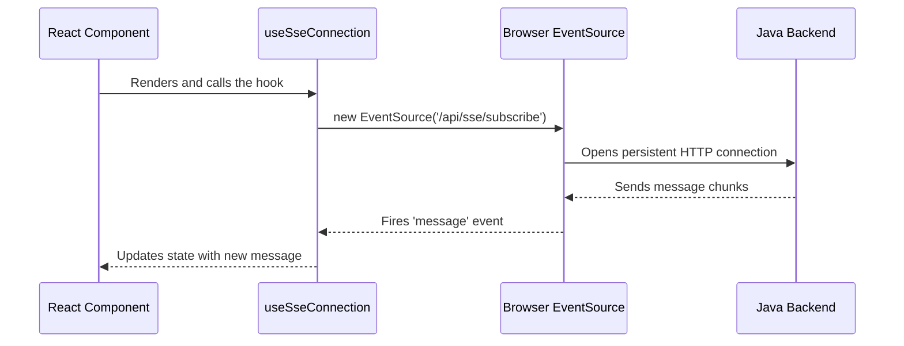

# The React Frontend

Let's move to the part of the system that users interact with directly: the frontend. This is a modern web application responsible for rendering the user interface (UI).

### Motivation: A Tale of Two Panels

Think of the frontend as a building with two different doors. One door leads to the **Admin Panel**, a control room where administrators can create and monitor broadcast messages. The other door leads to the **User Panel**, a simple lobby where users receive and read these messages.

The frontend's job is to present the right interface to the right person and manage all the client-side interactions.

### Core Explanation: React, Hooks, and Services

The frontend is built using **React**, a popular library for building user interfaces. It uses a few key concepts:

*   **Components**: Reusable UI pieces. We have components for the admin panel, the user message list, buttons, forms, etc. They are located in `broadcast-frontend/src/components/`.
*   **Custom Hooks**: These are special functions that contain reusable logic, like connecting to the backend or managing message state. You can find them in `broadcast-frontend/src/hooks/`.
*   **API Service**: A dedicated file (`broadcast-frontend/src/services/api.ts`) that handles all communication with the [Java Microservice](01_message_broadcasting_system.md).

### Code Example: Creating a Broadcast

When an admin creates a broadcast, they fill out a form. The logic for this is in `BroadcastCreationForm.tsx`. Here's a simplified look at how it sends the data to the backend:

```typescript
// Location: broadcast-frontend/src/components/broadcast/BroadcastCreationForm.tsx

import { api } from '@/services/api';

// This function is called when the form is submitted
async function onSubmit(data) {
  try {
    // Uses the API service to send a POST request
    await api.createBroadcast(data);
    toast({ title: "Broadcast created successfully!" });
  } catch (error) {
    toast({ title: "Error creating broadcast", variant: "destructive" });
  }
}
```
This snippet shows how the form calls a dedicated `api.createBroadcast` function, keeping the UI component clean and separated from the API logic.

### Internal Walkthrough: The `useSseConnection` Hook

The real-time functionality is powered by a custom hook, `useSseConnection`. It's responsible for establishing and maintaining the [Server-Sent Events (SSE)](02_server_sent_events.md) connection.



This hook encapsulates all the complexity of managing the connection, so the UI components only need to use the data it provides.

### Conclusion

The React frontend is a sophisticated client-side application that provides two distinct user experiences: one for admins and one for users. It uses a clean, service-oriented architecture to communicate with the backend.

