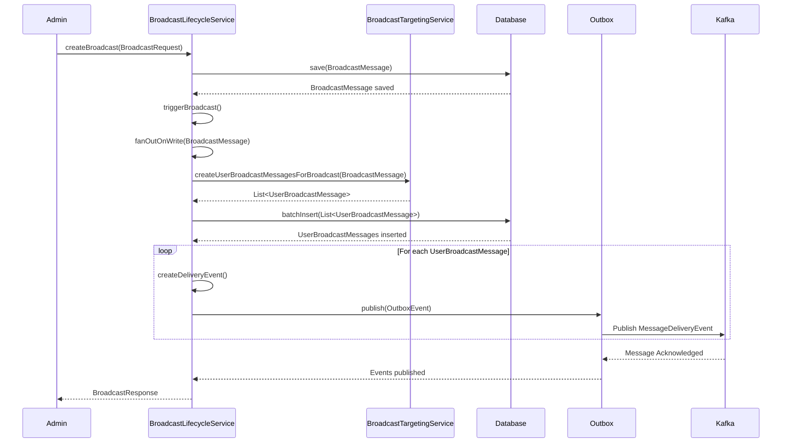
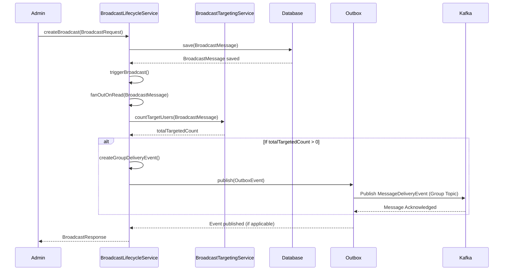

# Message Broadcasting System

## Motivation

Imagine you're trying to make an announcement to thousands of people simultaneously. You could try to talk to each person individually, but that would be incredibly time-consuming and inefficient. This is the problem that the Message Broadcasting System solves in our digital world.

The Broadcast Messaging System provides a way to send important notifications and messages to large groups of users efficiently. Whether it's system-wide announcements, targeted notifications to specific user groups, or critical alerts, this system ensures messages reach their intended recipients quickly and reliably.

## Core Explanation

At its heart, the Message Broadcasting System is a specialized communication pipeline designed for one-to-many message delivery. It allows administrators to create broadcast messages that can be delivered to all users, selected users, or users with specific roles.

The system works through several key components:

1. **Admin Interface**: Administrators create broadcast messages, specifying content, target audience, priority, and timing options.

2. **Message Storage**: All broadcasts are stored in a database with their metadata and delivery status.

3. **Message Distribution**: The system uses Kafka for efficient message fan-out to potentially thousands of recipients.

4. **Delivery Mechanisms**: Messages are delivered to users in real-time via Server-Sent Events (SSE) if they're online, or stored for later delivery when they reconnect.

5. **Tracking and Analytics**: The system tracks delivery and read status for each message, providing insights into message effectiveness.

## Code Examples

<details>
<summary>Creating a Broadcast Message</summary>

```java
// From BroadcastLifecycleService.java
public BroadcastResponse createBroadcast(BroadcastRequest request) {
    log.info("Creating broadcast from sender: {}, target: {}", request.getSenderId(), request.getTargetType());
    BroadcastMessage broadcast = buildBroadcastFromRequest(request);

    // Handle expiration
    if (broadcast.getExpiresAt() != null && broadcast.getExpiresAt().isBefore(ZonedDateTime.now(ZoneOffset.UTC))) {
        broadcast.setStatus(Constants.BroadcastStatus.EXPIRED.name());
        broadcast = broadcastRepository.save(broadcast);
        return broadcastMapper.toBroadcastResponse(broadcast, 0);
    }

    // Handle scheduling
    if (request.getScheduledAt() != null && request.getScheduledAt().isAfter(ZonedDateTime.now(ZoneOffset.UTC))) {
        broadcast.setStatus(Constants.BroadcastStatus.SCHEDULED.name());
        broadcast = broadcastRepository.save(broadcast);
        return broadcastMapper.toBroadcastResponse(broadcast, 0);
    }

    // Activate and trigger the broadcast
    broadcast.setStatus(Constants.BroadcastStatus.ACTIVE.name());
    broadcast = broadcastRepository.save(broadcast);
    return triggerBroadcast(broadcast);
}
```
</details>

<details>
<summary>Broadcast Message Data Model</summary>

```sql
-- From schema.sql
CREATE TABLE IF NOT EXISTS broadcast_messages (
    id BIGINT GENERATED BY DEFAULT AS IDENTITY PRIMARY KEY,
    sender_id VARCHAR(255) NOT NULL,
    sender_name VARCHAR(255) NOT NULL,
    content TEXT NOT NULL,
    target_type VARCHAR(50) NOT NULL CHECK (target_type IN ('ALL', 'SELECTED', 'ROLE')),
    target_ids TEXT, -- JSON array of user IDs or role IDs for targeted broadcasts
    priority VARCHAR(20) DEFAULT 'NORMAL' CHECK (priority IN ('LOW', 'NORMAL', 'HIGH', 'URGENT')),
    category VARCHAR(100),
    scheduled_at TIMESTAMP WITH TIME ZONE,
    expires_at TIMESTAMP WITH TIME ZONE,
    created_at TIMESTAMP WITH TIME ZONE DEFAULT CURRENT_TIMESTAMP,
    updated_at TIMESTAMP WITH TIME ZONE DEFAULT CURRENT_TIMESTAMP,
    status VARCHAR(20) DEFAULT 'ACTIVE' CHECK (status IN ('ACTIVE', 'SCHEDULED', 'EXPIRED', 'CANCELLED', 'FAILED')),
    is_fire_and_forget BOOLEAN DEFAULT false
);
```
</details>

## Internal Walkthrough

Let's walk through what happens when an administrator creates a new broadcast message:

### Immediate Broadcast Creation (Target Type: SELECTED)

This sequence diagram illustrates the flow for creating an immediate broadcast message targeted at specific users (`SELECTED` target type). It details the interaction between the Admin, `BroadcastLifecycleService`, `BroadcastTargetingService`, Database, Outbox, and Kafka.



### Immediate Broadcast Creation (Target Type: ROLE or ALL)

This sequence diagram illustrates the flow for creating an immediate broadcast message targeted at users by role or all users (`ROLE` or `ALL` target types). It details the interaction between the Admin, `BroadcastLifecycleService`, `BroadcastTargetingService`, Database, Outbox, and Kafka.



1. The admin creates a broadcast through the API
2. The system validates the request and creates a `BroadcastMessage` entity
3. If the message is scheduled for the future, it's saved with a SCHEDULED status
4. If the message is for immediate delivery, it's saved with an ACTIVE status
5. For active messages, the system:
   - Creates delivery records for each target user
   - Initializes statistics tracking
   - Publishes events to Kafka for distribution
   - Updates the cache for quick access
6. Kafka consumers process these events and deliver messages to online users via SSE

## Cross-Linking

The Message Broadcasting System integrates closely with several other components:

- [Server-Sent Events (SSE)](02_server_sent_events.md) for real-time message delivery
- [Kafka Event Streaming](03_kafka_event_streaming.md) for message distribution
- [Database Schema Design](04_database_schema_design.md) for message persistence
- [Redis Caching](05_redis_caching.md) for performance optimization

## Conclusion

The Message Broadcasting System provides a robust foundation for efficient one-to-many communication. By leveraging event-driven architecture and real-time delivery mechanisms, it ensures that messages reach their intended recipients quickly and reliably, while providing administrators with the tools to target, schedule, and track their broadcasts effectively.

In the next chapter, we'll explore how [Server-Sent Events (SSE)](02_server_sent_events.md) enable real-time message delivery to connected clients.