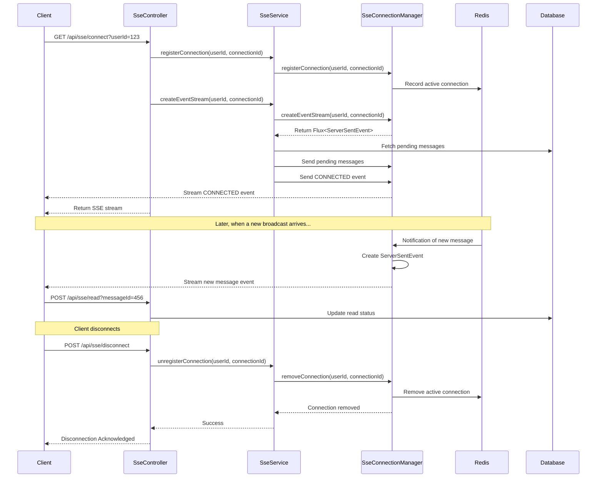

# Server-Sent Events (SSE)

## Motivation

Imagine you're waiting for an important package. You could call the delivery company every few minutes to check if there's an update (like traditional polling), or they could simply call you when there's news (like push notifications). Server-Sent Events (SSE) works like the latter - it establishes a one-way channel where the server can push updates to clients as they happen, without clients needing to constantly ask for updates.

In the context of our Broadcast Messaging System, we need a way to deliver messages to users in real-time with minimal latency. Traditional HTTP request-response cycles would require clients to poll the server frequently, which is inefficient and doesn't provide true real-time delivery. SSE solves this problem by providing a persistent connection that allows the server to push messages to clients as soon as they're available.

## Core Explanation

Server-Sent Events (SSE) is a standard that enables efficient server-to-client streaming over HTTP. Unlike WebSockets, which provide bi-directional communication, SSE is optimized for scenarios where the server needs to push data to the client, but the client doesn't need to send data back through the same connection.

Key characteristics of SSE include:

1. **HTTP-Based**: Uses standard HTTP/HTTPS, making it compatible with existing infrastructure
2. **Automatic Reconnection**: Browsers automatically attempt to reconnect if the connection is lost
3. **Event IDs**: Supports event IDs for tracking which events a client has received
4. **Event Types**: Allows categorizing different types of events
5. **Text-Based**: Uses a simple text-based protocol

In our system, SSE connections are managed by the `SseConnectionManager` and `SseService` components, which handle connection establishment, message delivery, and connection tracking.

## Code Examples

<details>
<summary>SSE Controller for Client Connections</summary>

```java
// From SseController.java
@GetMapping(value = "/connect", produces = MediaType.TEXT_EVENT_STREAM_VALUE)
@RateLimiter(name = "sseConnectLimiter", fallbackMethod = "connectFallback")
public Flux<ServerSentEvent<String>> connect(
        @RequestParam String userId,
        @RequestParam(required = false) String connectionId,
        ServerWebExchange exchange) {

    log.info("SSE connection request from user: {}, connection: {}, IP: {}",
             userId, connectionId, exchange.getRequest().getRemoteAddress() != null ? 
                 exchange.getRequest().getRemoteAddress().getAddress().getHostAddress() : "unknown");

    if (connectionId == null || connectionId.trim().isEmpty()) {
        connectionId = UUID.randomUUID().toString();
    }

    sseService.registerConnection(userId, connectionId);
    Flux<ServerSentEvent<String>> eventStream = sseService.createEventStream(userId, connectionId);
    log.info("SSE connection established for user: {}, connection: {}", userId, connectionId);
    return eventStream;
}
```
</details>

<details>
<summary>Creating an Event Stream</summary>

```java
// From SseService.java
public Flux<ServerSentEvent<String>> createEventStream(String userId, String connectionId) {
    log.info("Orchestrating event stream creation for user: {}, connection: {}", userId, connectionId);
    Flux<ServerSentEvent<String>> eventStream = sseConnectionManager.createEventStream(userId, connectionId);

    // Send pending messages specifically targeted to this user
    sendPendingMessages(userId);
    
    // Send active global and role-based messages
    sendActiveGroupMessages(userId); 

    try {
        String connectedPayload = objectMapper.writeValueAsString(Map.of("message", 
                                "SSE connection established with connection " + connectionId));
        sseConnectionManager.sendEvent(userId, ServerSentEvent.<String>builder()
            .event(SseEventType.CONNECTED.name())
            .data(connectedPayload)
            .build());
    } catch (JsonProcessingException e) {
        log.error("Error creating CONNECTED event", e);
    }
    
    return eventStream;
}
```
</details>

## Internal Walkthrough

Let's walk through the SSE connection and message delivery process:



1. The client initiates an SSE connection by making a GET request to the `/api/sse/connect` endpoint
2. The `SseController` registers the connection with the `SseService`
3. The `SseService` delegates to the `SseConnectionManager` to create and manage the event stream
4. The system fetches any pending messages for the user and sends them immediately
5. A CONNECTED event is sent to confirm the connection is established
6. The SSE stream is returned to the client, keeping the connection open
7. When new broadcasts are created, they're delivered through the existing SSE connection
8. The client can mark messages as read by making a separate HTTP request

## Cross-Linking

SSE is a critical component that works closely with:

- [Message Broadcasting System](01_message_broadcasting_system.md) which generates the messages to be delivered
- [Kafka Event Streaming](03_kafka_event_streaming.md) which triggers the delivery process
- [Redis Caching](05_redis_caching.md) which helps manage connection state across multiple instances
- [User Connection Management](06_user_connection_management.md) which details how user connections are managed for SSE connections


## Conclusion

Server-Sent Events provide an elegant solution for real-time message delivery in our Broadcast Messaging System. By establishing persistent connections with clients, we can push messages to them as soon as they're available, ensuring sub-second delivery latency for online users. The SSE implementation is designed to be scalable and resilient, with support for reconnection, distributed connection management, and high-concurrency operations.

In the next chapter, we'll explore how [Kafka Event Streaming](03_kafka_event_streaming.md) enables efficient message distribution across the system.