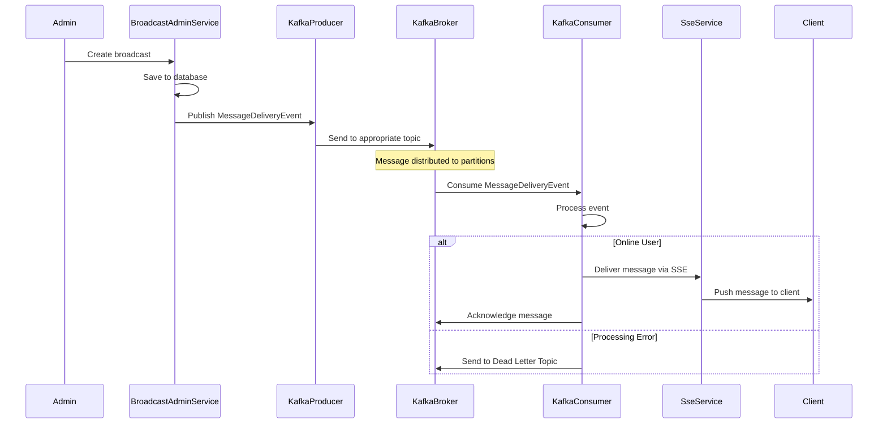

# Kafka Event Streaming

## Motivation

Imagine you're organizing a massive concert where thousands of attendees need to receive important announcements. You could try to shout to everyone at once, but your voice would only reach a small portion of the crowd. Instead, you might set up a network of speakers throughout the venue, each responsible for relaying your message to a section of the audience.

This is similar to the challenge our Broadcast Messaging System faces: how do we efficiently deliver messages to potentially hundreds of thousands of users without overwhelming our system? This is where Kafka event streaming comes in.

Kafka provides a distributed messaging system that allows us to decouple message production from consumption, enabling efficient fan-out of messages to large numbers of recipients while maintaining system resilience and scalability.

## Core Explanation

Apache Kafka is a distributed event streaming platform that excels at handling high-throughput, fault-tolerant message distribution. In our Broadcast Messaging System, Kafka serves as the backbone for message distribution, enabling efficient fan-out of broadcasts to their intended recipients.

Key concepts in our Kafka implementation include:

1. **Topics**: We use separate topics for different types of broadcasts:
   - `broadcast-user-service-selected`: For broadcasts to specific users
   - `broadcast-user-service-group`: For broadcasts to all users or groups or roles

2. **Partitioning**: Each topic is divided into 10 partitions, allowing parallel processing of messages

3. **Replication**: Topics have a replication factor of 3 for fault tolerance

4. **Producers**: The `BroadcastLifecycleService` publishes `MessageDeliveryEvent` objects to the appropriate topics

5. **Consumers**: The `KafkaConsumerService` processes these events and triggers message delivery via SSE

6. **Dead Letter Topic (DLT)**: Failed message processing is redirected to a DLT for later analysis and potential reprocessing

## Code Examples

<details>
<summary>Kafka Consumer Service</summary>

```java
// From KafkaConsumerService.java
@KafkaListener(
        topics = "${broadcast.kafka.topic.name.selected:broadcast-user-service-selected}",
        groupId = "${spring.kafka.consumer.group-id:broadcast-service-group}-selected",
        containerFactory = "kafkaListenerContainerFactory"
)
public void processSelectedUsersBroadcastEvent(
        @Payload MessageDeliveryEvent event,
        @Header(KafkaHeaders.RECEIVED_TOPIC) String topic,
        @Header(KafkaHeaders.RECEIVED_PARTITION) String partition,
        @Header(KafkaHeaders.OFFSET) long offset,
        Acknowledgment acknowledgment) {
    
    if (testingConfigurationService.isMarkedForFailure(event.getBroadcastId())) {
        log.warn("DLT TEST MODE [SELECTED]: Simulating failure for broadcast ID: {}", event.getBroadcastId());
        throw new RuntimeException("Simulating DLT failure for broadcast ID: " + event.getBroadcastId());
    }

    processBroadcastEvent(event, topic, partition, offset, acknowledgment);
}
```
</details>

## Internal Walkthrough

Let's walk through how Kafka is used in the message delivery process:



1. When an administrator creates a broadcast, the `BroadcastLifecycleService` saves it to the database and creates `MessageDeliveryEvent` objects for each recipient

2. These events are published to the appropriate Kafka topic based on the broadcast type:
   - Targeted broadcasts go to `broadcast-user-service-selected`
   - All users / Role-based broadcasts go to `broadcast-user-service-group`

3. Kafka distributes these events across partitions, allowing multiple consumers to process them in parallel

4. The `KafkaConsumerService` consumes these events and processes them:
   - For online users, it delivers the message via SSE
   - For offline users, it marks the message as pending for delivery on reconnect

5. If processing fails, the event is sent to the Dead Letter Topic for later analysis and potential reprocessing

6. Once processing is complete, the consumer acknowledges the message to Kafka

## Cross-Linking

Kafka Event Streaming integrates closely with:

- [Message Broadcasting System](01_message_broadcasting_system.md) which generates the events
- [Server-Sent Events (SSE)](02_server_sent_events.md) which delivers the messages to clients
- [Database Schema Design](04_database_schema_design.md) which stores the message state
- [Dead Letter Topic (DLT) Management](07_dlt_management.md) which handles failed message processing


## Conclusion

Kafka Event Streaming provides the backbone for efficient message distribution in our Broadcast Messaging System. By decoupling message production from consumption and enabling parallel processing, it allows the system to handle high volumes of messages while maintaining resilience and scalability. The use of separate topics for different broadcast types, along with partitioning and replication, ensures optimal performance and fault tolerance.

In the next chapter, we'll explore the [Database Schema Design](04_database_schema_design.md) that supports our message persistence and tracking capabilities.