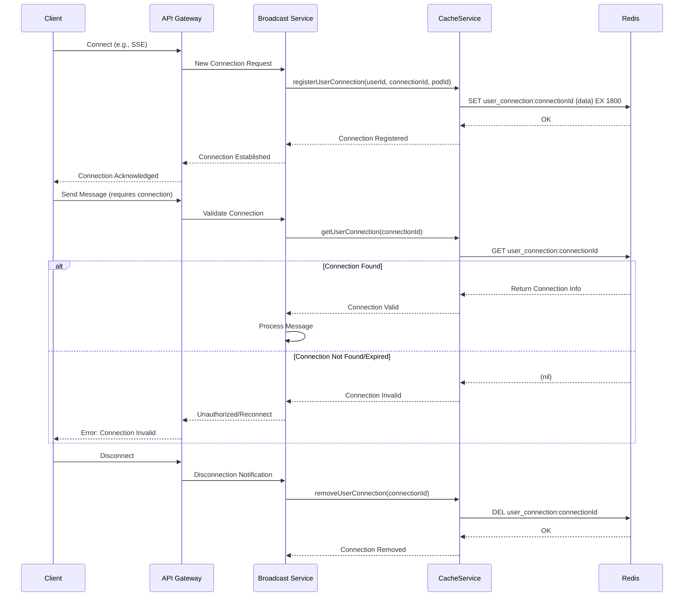

# User Connection Management

This document outlines the user connection management within the Broadcast Messaging System.

## Motivation

Effective user connection management is crucial for maintaining state, personalizing user experiences, and ensuring security in a distributed system. In our Broadcast Messaging System, managing user connections allows us to:

- Track active user connections for real-time message delivery.
- Persist user preferences and states across different interactions.
- Implement security measures like connection timeouts and authentication.
- Provide a seamless experience for users, even across multiple devices or browser tabs.

## Core Explanation

User connection management in this system involves several components working together to establish, maintain, and terminate user connections. Key aspects include:

- **Connection Creation**: When a user connects to the system (e.g., via Server-Sent Events), a unique connection is created.
- **Connection Storage**: Connection information, such as user ID, connection ID, and connection details, is stored in a fast, accessible data store (e.g., Redis).
- **Connection Validation**: Incoming requests are validated against active connections to ensure authenticity and authorization.
- **Connection Invalidation**: Connections are invalidated upon user logout, timeout, or administrative action.
- **Heartbeats/Keep-alives**: Mechanisms to keep connections alive and detect disconnected clients.

## Code Examples

<details>
<summary>User Connection Information Model</summary>

This model represents the information stored for each user connection.

```java
// Excerpt from UserConnectionInfo.java
public class UserConnectionInfo {
    private String userId;
    private String connectionId;
    private String podId;
    private ZonedDateTime connectedAt;

    // Getters, Setters, Constructors
}
```
</details>

<details>
<summary>Connection Management in Cache Service</summary>

The `CacheService` (implemented by `RedisCacheService`) handles the storage and retrieval of user connection information.

```java
// Excerpt from RedisCacheService.java
@Service
public class RedisCacheService implements CacheService {

    private final RedisTemplate<String, UserConnectionInfo> userConnectionRedisTemplate;

    @Override
    public void registerUserConnection(String userId, String connectionId, String podId) {
        UserConnectionInfo connectionInfo = new UserConnectionInfo(userId, connectionId, podId, ZonedDateTime.now());
        String connectionKey = USER_CONNECTION_KEY_PREFIX + connectionId;
        // TTL for user connection info
        userConnectionRedisTemplate.opsForValue().set(connectionKey, connectionInfo, 30, TimeUnit.MINUTES);
        log.debug("User connection registered in Redis: {} on pod {}", userId, podId);
    }

    @Override
    public UserConnectionInfo getUserConnection(String connectionId) {
        return userConnectionRedisTemplate.opsForValue().get(USER_CONNECTION_KEY_PREFIX + connectionId);
    }

    @Override
    public void removeUserConnection(String connectionId) {
        userConnectionRedisTemplate.delete(USER_CONNECTION_KEY_PREFIX + connectionId);
    }

    // ... other methods
}
```
</details>

## Internal Walkthrough



1. **Connection Establishment**: When a client connects, the Broadcast Service registers the user's connection information (user ID, connection ID, pod ID, connection timestamp) in Redis via the `CacheService`.
2. **Connection Persistence**: Redis stores this connection data with a Time-To-Live (TTL) to ensure connections automatically expire if not refreshed.
3. **Connection Validation**: For subsequent interactions, the Broadcast Service retrieves connection information from Redis to validate the client's active connection.
4. **Connection Invalidation**: Upon disconnection or explicit logout, the connection is removed from Redis.

## Cross-Linking

User Connection Management is closely related to:

- [Server-Sent Events](02_server_sent_events.md) which relies on active user connections for real-time communication.
- [Redis Caching](05_redis_caching.md) which is used as the underlying technology for storing and managing connection data.
- [Monitoring and Observability](09_monitoring_and_observability.md) for tracking active connections and connection-related metrics.

## Conclusion

User connection management is a fundamental aspect of the Broadcast Messaging System, enabling robust, secure, and personalized real-time communication. By leveraging Redis, we ensure high performance and scalability for connection handling.