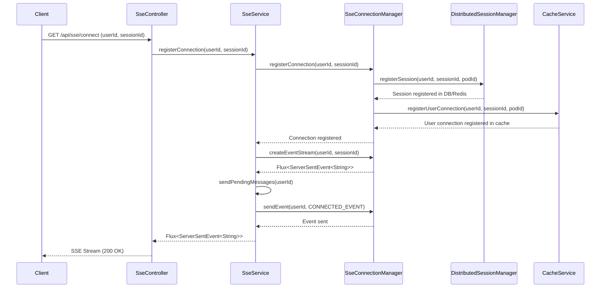
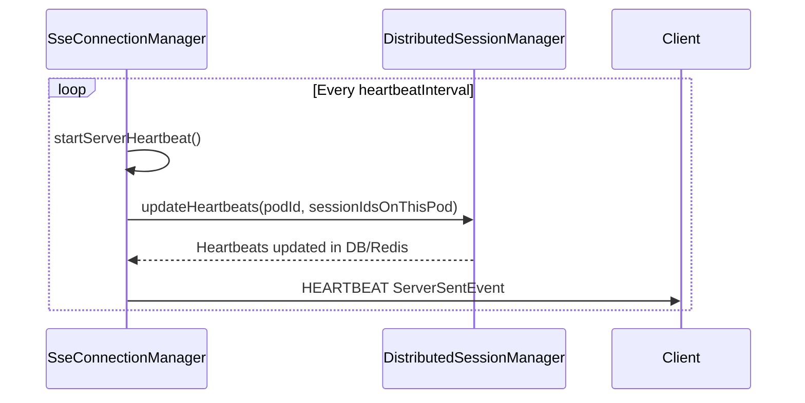
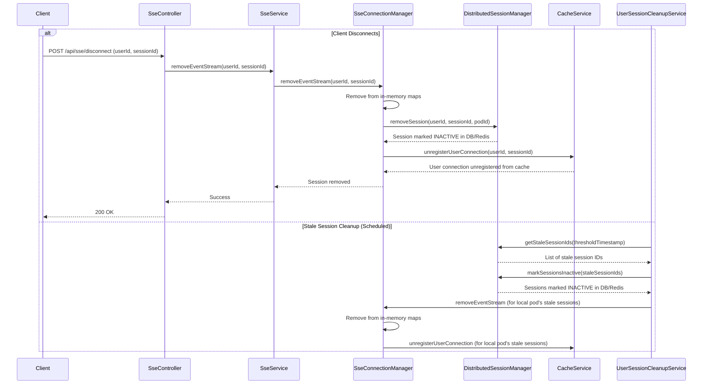

# User Session Management

The Broadcast Microservice manages user sessions for Server-Sent Events (SSE) to ensure real-time communication and efficient resource utilization. This document outlines the key components and flows involved in user session management, including session creation, registration, heartbeat updates, and cleanup.

## Key Components

### 1. SseConnectionManager

<mcsymbol name="SseConnectionManager" filename="SseConnectionManager.java" path="c:\Users\Srini\ws\Notification-SSE-GLM-Flux\broadcast-microservice\src\main\java\com\example\broadcast\user\service\SseConnectionManager.java" startline="37" type="class"></mcsymbol> is the core component responsible for managing the low-level technical aspects of SSE connections. It maintains in-memory state for connections on the current pod and handles the lifecycle of SSE streams.

**Responsibilities:**
- Creating and storing in-memory sinks for each client connection.
- Tracking active user-to-session mappings.
- Persisting session state to the database or Redis.
- Sending periodic heartbeats to keep connections alive.
- Cleaning up stale or disconnected sessions from memory and the distributed store.

### 2. DistributedSessionManager

<mcsymbol name="DistributedSessionManager" filename="DistributedSessionManager.java" path="c:\Users\Srini\ws\Notification-SSE-GLM-Flux\broadcast-microservice\src\main\java\com\example\broadcast\user\service\DistributedSessionManager.java" startline="11" type="class"></mcsymbol> is an interface that abstracts the underlying session storage mechanism. It provides methods for registering, removing, updating heartbeats, and querying session information in a distributed environment.

**Implementations:**
- <mcsymbol name="RedisSessionManager" filename="RedisSessionManager.java" path="c:\Users\Srini\ws\Notification-SSE-GLM-Flux\broadcast-microservice\src\main\java\com\example\broadcast\user\service\RedisSessionManager.java" startline="14" type="class"></mcsymbol>: Manages sessions using Redis as the distributed store. 

### 3. SseController

<mcsymbol name="SseController" filename="SseController.java" path="c:\Users\Srini\ws\Notification-SSE-GLM-Flux\broadcast-microservice\src\main\java\com\example\broadcast\user\controller\SseController.java" startline="20" type="class"></mcsymbol> handles incoming HTTP requests for SSE connections, disconnections, and session statistics.

### 4. SseService

<mcsymbol name="SseService" filename="SseService.java" path="c:\Users\Srini\ws\Notification-SSE-GLM-Flux\broadcast-microservice\src\main\java\com\example\broadcast\user\service\SseService.java" startline="20" type="class"></mcsymbol> acts as an orchestrator, coordinating between <mcsymbol name="SseConnectionManager" filename="SseConnectionManager.java" path="c:\Users\Srini\ws\Notification-SSE-GLM-Flux\broadcast-microservice\src\main\java\com\example\broadcast\user\service\SseConnectionManager.java" startline="37" type="class"></mcsymbol> and other services for message delivery and session management.

### 5. UserSessionCleanupService

This is a scheduled service (documented in <mcfile name="07_scheduler_flow2.md" path="docs/07_scheduler_flow2.md"></mcfile>) responsible for purging old, inactive user sessions from the database.

## Session Management Flow

### 1. Connection Establishment

When a client connects to the SSE endpoint (`/api/sse/connect`):

### 2. Heartbeat Updates

To keep connections alive and track active sessions, <mcsymbol name="SseConnectionManager" filename="SseConnectionManager.java" path="c:\Users\Srini\ws\Notification-SSE-GLM-Flux\broadcast-microservice\src\main\java\com\example\broadcast\user\service\SseConnectionManager.java" startline="37" type="class"></mcsymbol> sends periodic heartbeats and updates the `lastHeartbeat` timestamp for active sessions.

### 3. Connection Termination and Stale Session Cleanup

When a client disconnects or a session becomes stale, the system initiates cleanup processes.

