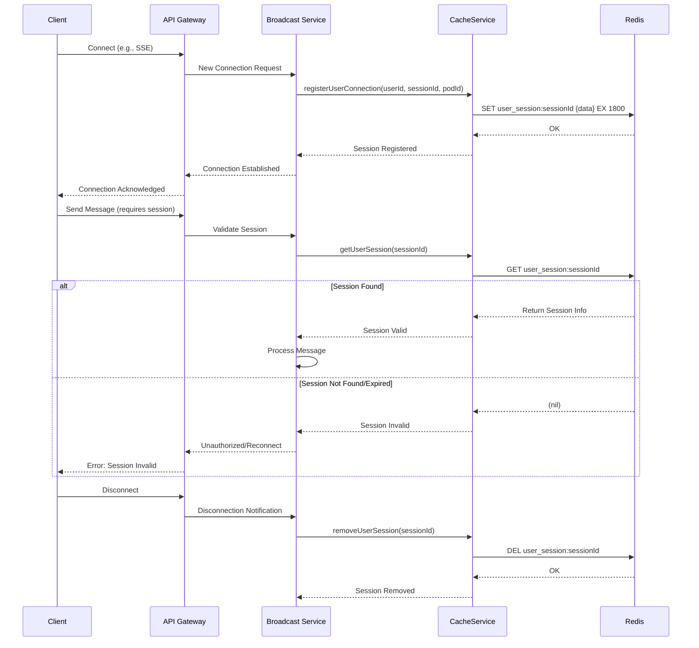

# User Session Management

This document outlines the user session management within the Broadcast Messaging System.

## Motivation

Effective user session management is crucial for maintaining state, personalizing user experiences, and ensuring security in a distributed system. In our Broadcast Messaging System, managing user sessions allows us to:

- Track active user connections for real-time message delivery.
- Persist user preferences and states across different interactions.
- Implement security measures like session timeouts and authentication.
- Provide a seamless experience for users, even across multiple devices or browser tabs.

## Core Explanation

User session management in this system involves several components working together to establish, maintain, and terminate user sessions. Key aspects include:

- **Session Creation**: When a user connects to the system (e.g., via Server-Sent Events), a unique session is created.
- **Session Storage**: Session information, such as user ID, session ID, and connection details, is stored in a fast, accessible data store (e.g., Redis).
- **Session Validation**: Incoming requests are validated against active sessions to ensure authenticity and authorization.
- **Session Invalidation**: Sessions are invalidated upon user logout, timeout, or administrative action.
- **Heartbeats/Keep-alives**: Mechanisms to keep sessions alive and detect disconnected clients.

## Code Examples

<details>
<summary>User Session Information Model</summary>

This model represents the information stored for each user session.

```java
// Excerpt from UserSessionInfo.java
public class UserSessionInfo {
    private String userId;
    private String sessionId;
    private String podId;
    private ZonedDateTime connectedAt;

    // Getters, Setters, Constructors
}
```
</details>

<details>
<summary>Session Management in Cache Service</summary>

The `CacheService` (implemented by `RedisCacheService`) handles the storage and retrieval of user session information.

```java
// Excerpt from RedisCacheService.java
@Service
public class RedisCacheService implements CacheService {

    private final RedisTemplate<String, UserSessionInfo> userSessionRedisTemplate;

    @Override
    public void registerUserConnection(String userId, String sessionId, String podId) {
        UserSessionInfo sessionInfo = new UserSessionInfo(userId, sessionId, podId, ZonedDateTime.now());
        String sessionKey = USER_SESSION_KEY_PREFIX + sessionId;
        // TTL for user session info
        userSessionRedisTemplate.opsForValue().set(sessionKey, sessionInfo, 30, TimeUnit.MINUTES);
        log.debug("User session registered in Redis: {} on pod {}", userId, podId);
    }

    @Override
    public UserSessionInfo getUserSession(String sessionId) {
        return userSessionRedisTemplate.opsForValue().get(USER_SESSION_KEY_PREFIX + sessionId);
    }

    @Override
    public void removeUserSession(String sessionId) {
        userSessionRedisTemplate.delete(USER_SESSION_KEY_PREFIX + sessionId);
    }

    // ... other methods
}
```
</details>

## Internal Walkthrough



1. **Connection Establishment**: When a client connects, the Broadcast Service registers the user's session information (user ID, session ID, pod ID, connection timestamp) in Redis via the `CacheService`.
2. **Session Persistence**: Redis stores this session data with a Time-To-Live (TTL) to ensure sessions automatically expire if not refreshed.
3. **Session Validation**: For subsequent interactions, the Broadcast Service retrieves session information from Redis to validate the client's active session.
4. **Session Invalidation**: Upon disconnection or explicit logout, the session is removed from Redis.

## Cross-Linking

User Session Management is closely related to:

- [Server-Sent Events](02_server_sent_events.md) which relies on active user sessions for real-time communication.
- [Redis Caching](05_redis_caching.md) which is used as the underlying technology for storing and managing session data.
- [Monitoring and Observability](09_monitoring_and_observability.md) for tracking active sessions and session-related metrics.

## Conclusion

User session management is a fundamental aspect of the Broadcast Messaging System, enabling robust, secure, and personalized real-time communication. By leveraging Redis, we ensure high performance and scalability for session handling.