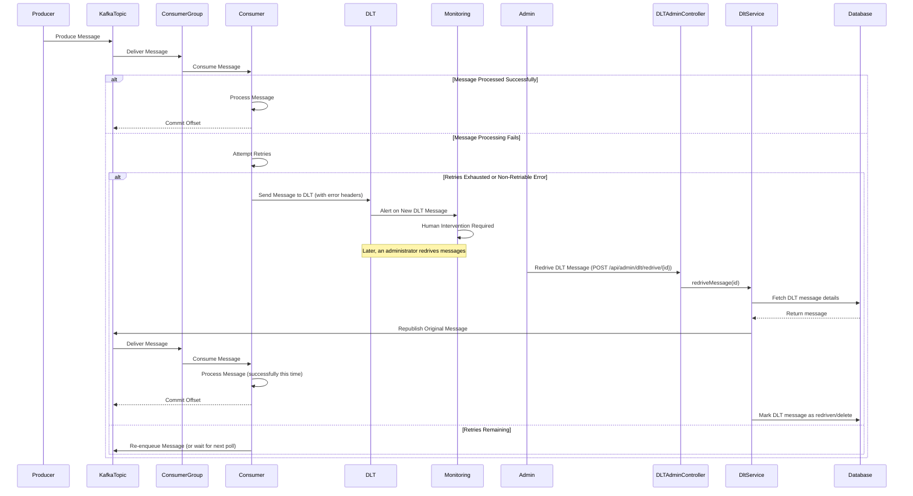

# Dead Letter Topic (DLT) Management

This document describes the Dead Letter Topic (DLT) management strategy within the Broadcast Messaging System, particularly in the context of Kafka event streaming.

## Motivation

In a distributed event-driven architecture like ours, messages can sometimes fail to be processed successfully due to various reasons, such as:

- **Transient errors**: Temporary network issues, database unavailability, or service restarts.
- **Data format errors**: Malformed messages that cannot be deserialized or processed by consumers.
- **Business logic errors**: Messages that violate business rules or lead to unexpected states.

Without a proper mechanism to handle these failures, such messages might be lost, block processing of subsequent messages, or lead to data inconsistencies. Dead Letter Topics (DLTs) provide a robust solution to isolate and manage these failed messages, preventing data loss and enabling manual inspection, reprocessing, or discarding.

## Core Explanation

Our DLT management strategy involves routing messages that fail processing in our Kafka consumers to a dedicated "dead letter" topic. This ensures that the main processing pipeline remains unblocked and healthy. Key aspects include:

- **Automatic Retries**: Consumers are configured with a retry mechanism for transient errors. Only after a configured number of retries are exhausted, or if the error is non-retriable (e.g., deserialization error), is the message sent to the DLT.
- **Dedicated DLT**: Each main Kafka topic that requires DLT handling has a corresponding dead letter topic (e.g., `broadcast_messages.dlt`).
- **Error Context**: When a message is sent to the DLT, additional headers are added to the message to provide context about the failure, such as the exception type, error message, and original topic/partition/offset.
- **Monitoring**: The DLTs are monitored for new messages, triggering alerts for operational teams.
- **Manual Intervention**: Messages in the DLT can be manually inspected, debugged, fixed, and then replayed to the original topic or discarded.

## Code Examples

<details>
<summary>Kafka Consumer with DLT Handling</summary>

This example illustrates how a Kafka consumer is configured to send failed messages to a DLT after retries.

```java
// Excerpt from KafkaConsumerService.java (simplified)
@Service
@Slf4j
public class KafkaConsumerService {

    private final KafkaTemplate<String, Object> kafkaTemplate;

    // ... other dependencies

    @KafkaListener(topics = "broadcast_messages", groupId = "broadcast-group")
    public void listenBroadcastMessages(ConsumerRecord<String, BroadcastMessage> record) {
        try {
            // Process message
            log.info("Processing broadcast message: {}", record.value().getMessageId());
            // Simulate a processing error for demonstration
            if (record.value().getMessageId().equals("simulate-error")) {
                throw new RuntimeException("Simulated processing error");
            }
            // ... actual message processing logic
        } catch (Exception e) {
            log.error("Failed to process broadcast message: {}", record.value().getMessageId(), e);
            // Send to DLT after retries or for non-retriable errors
            sendToDlt(record, "broadcast_messages.dlt", e);
        }
    }

    private void sendToDlt(ConsumerRecord<String, ?> record, String dltTopic, Exception e) {
        ProducerRecord<String, ?> producerRecord = new ProducerRecord<>(dltTopic, record.key(), record.value());
        producerRecord.headers().add("x-dlt-exception-message", e.getMessage().getBytes(StandardCharsets.UTF_8));
        producerRecord.headers().add("x-dlt-exception-stacktrace", ExceptionUtils.getStackTrace(e).getBytes(StandardCharsets.UTF_8));
        producerRecord.headers().add("x-dlt-original-topic", record.topic().getBytes(StandardCharsets.UTF_8));
        producerRecord.headers().add("x-dlt-original-partition", String.valueOf(record.partition()).getBytes(StandardCharsets.UTF_8));
        producerRecord.headers().add("x-dlt-original-offset", String.valueOf(record.offset()).getBytes(StandardCharsets.UTF_8));
        producerRecord.headers().add("x-dlt-timestamp", String.valueOf(System.currentTimeMillis()).getBytes(StandardCharsets.UTF_8));

        kafkaTemplate.send(producerRecord);
        log.warn("Message sent to DLT {}: {}", dltTopic, record.key());
    }

    // ... other methods
}
```
</details>

<details>
<summary>Kafka Topic Configuration for DLT</summary>

DLTs are configured like regular Kafka topics, often with longer retention policies to allow for manual inspection.

```yaml
# Excerpt from k8s/base/kafka-topic.yaml (simplified)
apiVersion: kafka.strimzi.io/v1beta2
kind: KafkaTopic
metadata:
  name: broadcast-messages-dlt
  labels:
    strimzi.io/cluster: my-kafka-cluster
spec:
  topicName: broadcast_messages.dlt
  partitions: 3
  replicas: 3
  config:
    retention.ms: 604800000 # 7 days
    segment.bytes: 1073741824
```
</details>

## Internal Walkthrough



1. **Message Consumption**: A Kafka consumer attempts to process a message from its assigned topic.
2. **Error Handling**: If an error occurs during processing, the consumer's error handling logic is triggered.
3. **Retry Mechanism**: For transient errors, the consumer may retry processing the message a few times.
4. **DLT Routing**: If retries are exhausted or the error is persistent/non-retriable, the message, along with failure context (e.g., exception details), is sent to the designated Dead Letter Topic.
5. **Monitoring and Alerting**: The DLT is continuously monitored. The arrival of new messages in the DLT triggers alerts to notify operations teams of processing failures.
6. **Manual Resolution**: Operations teams can then inspect the messages in the DLT, diagnose the root cause, and decide whether to fix the issue and reprocess the messages, or discard them.

## Cross-Linking

DLT Management is an integral part of:

- [Kafka Event Streaming](03_kafka_event_streaming.md) as it directly deals with message processing failures in Kafka.
- [Monitoring and Observability](09_monitoring_and_observability.md) for tracking and alerting on messages in DLTs.
- [Testing Strategies](10_testing_strategies.md) for ensuring robust error handling and DLT routing in integration tests.

## DLT Cleanup

While DLTs are designed to retain messages for inspection, it's also important to have a mechanism to clean them up periodically to prevent unbounded growth. The `DltService` provides a method to purge all messages from the DLT.

<details>
<summary>Purge All Messages from DLT</summary>

```java
// Excerpt from DltService.java
@Service
public class DltService {

    private final DltRepository dltRepository;
    private final KafkaTemplate<String, Object> kafkaTemplate;

    @Transactional
    public void purgeAllMessages() {
        // Logic to delete messages from database and send tombstone records to Kafka
    }
}
```
</details>

This `purgeAllMessages` method can be invoked manually or integrated into a scheduled cleanup job (e.g., via a separate scheduler service or an administrative endpoint) to manage the size of the DLT.

## Conclusion

Dead Letter Topic management is a critical component of our resilient event streaming architecture. By effectively isolating and managing failed messages, and providing mechanisms for cleanup, we ensure the stability and reliability of the Broadcast Messaging System, preventing data loss and facilitating efficient troubleshooting.