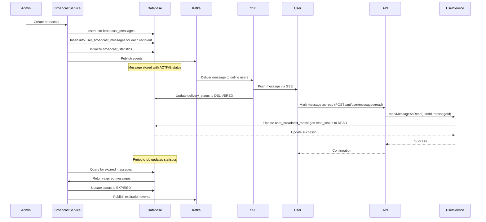

# Database Schema Design

## Motivation

Imagine you're running a postal service that needs to track millions of packages, their destinations, delivery status, and customer receipts. You'd need a well-organized system of records to ensure nothing gets lost and you can quickly answer questions like "Where is package #12345?" or "How many packages were delivered to the downtown area yesterday?"

Similarly, our Broadcast Messaging System needs a robust database schema to track all broadcasts, their recipients, delivery status, and performance metrics. A well-designed schema ensures we can efficiently store, retrieve, and analyze message data while maintaining system performance even under high load.

## Core Explanation

The database schema for our Broadcast Messaging System is designed to efficiently handle high-volume message tracking while supporting analytics and performance monitoring. It uses a relational database (H2 in development, PostgreSQL in production) with carefully designed tables, relationships, and indexes.

The schema consists of several key tables:

1. **broadcast_messages**: The central table that stores all broadcast messages created by administrators. It includes message content, targeting information, scheduling, expiration, and status.

2. **user_broadcast_messages**: A join table that tracks the delivery status of each broadcast for each recipient. It records whether a message has been delivered, read, or failed delivery.

3. **broadcast_statistics**: Aggregates delivery metrics for each broadcast, such as total targeted users, delivery rate, and read rate.

4. **user_preferences**: Stores user notification preferences, including opt-out settings and category preferences.

5. **outbox_events**: Implements the Outbox Pattern for reliable event publishing to Kafka.

The schema is optimized with appropriate indexes for common query patterns and uses constraints to ensure data integrity.

## Code Examples

<details>
<summary>Core Tables Schema</summary>

```sql
-- From schema.sql
-- Broadcast Messages Table (Admin-side records)
CREATE TABLE IF NOT EXISTS broadcast_messages (
    id BIGINT GENERATED BY DEFAULT AS IDENTITY PRIMARY KEY,
    sender_id VARCHAR(255) NOT NULL,
    sender_name VARCHAR(255) NOT NULL,
    content TEXT NOT NULL,
    target_type VARCHAR(50) NOT NULL CHECK (target_type IN ('ALL', 'SELECTED', 'ROLE')),
    target_ids TEXT, -- JSON array of user IDs or role IDs for targeted broadcasts
    priority VARCHAR(20) DEFAULT 'NORMAL' CHECK (priority IN ('LOW', 'NORMAL', 'HIGH', 'URGENT')),
    category VARCHAR(100),
    scheduled_at TIMESTAMP WITH TIME ZONE,
    expires_at TIMESTAMP WITH TIME ZONE,
    created_at TIMESTAMP WITH TIME ZONE DEFAULT CURRENT_TIMESTAMP,
    updated_at TIMESTAMP WITH TIME ZONE DEFAULT CURRENT_TIMESTAMP,
    status VARCHAR(20) DEFAULT 'ACTIVE' CHECK (status IN ('ACTIVE', 'SCHEDULED', 'EXPIRED', 'CANCELLED', 'FAILED')),
    is_fire_and_forget BOOLEAN DEFAULT false
);

-- User Broadcast Messages Table (User-side records)
CREATE TABLE IF NOT EXISTS user_broadcast_messages (
    id BIGINT GENERATED BY DEFAULT AS IDENTITY PRIMARY KEY,
    broadcast_id BIGINT NOT NULL,
    user_id VARCHAR(255) NOT NULL,
    delivery_status VARCHAR(20) DEFAULT 'PENDING' CHECK (delivery_status IN ('PENDING', 'DELIVERED', 'FAILED', 'SUPERSEDED')),
    read_status VARCHAR(20) DEFAULT 'UNREAD' CHECK (read_status IN ('UNREAD', 'READ')),
    delivered_at TIMESTAMP WITH TIME ZONE,
    read_at TIMESTAMP WITH TIME ZONE,
    created_at TIMESTAMP WITH TIME ZONE DEFAULT CURRENT_TIMESTAMP,
    updated_at TIMESTAMP WITH TIME ZONE DEFAULT CURRENT_TIMESTAMP,
    -- Foreign key constraint
    FOREIGN KEY (broadcast_id) REFERENCES broadcast_messages(id) ON DELETE CASCADE,
    
    -- Unique constraint to prevent duplicate user-broadcast entries
    UNIQUE (broadcast_id, user_id)
);
```
</details>

<details>
<summary>Database Repository Example</summary>

```java
// From BroadcastRepository.java
public interface BroadcastRepository {
    BroadcastMessage save(BroadcastMessage broadcast);
    void update(BroadcastMessage broadcast);
    Optional<BroadcastMessage> findById(Long id);
    List<BroadcastMessage> findAll();
    List<BroadcastMessage> findByStatus(String status);
    List<BroadcastMessage> findActiveBroadcastsByTargetType(String targetType);
    List<BroadcastMessage> findScheduledBroadcastsDueForDelivery();
    List<BroadcastMessage> findExpiredBroadcasts();
    int markAsExpired(List<Long> ids);
    void delete(Long id);
}
```
</details>

## Internal Walkthrough

Let's walk through how the database schema supports the message lifecycle:



1. When a broadcast is created, it's stored in the `broadcast_messages` table with its metadata

2. For each recipient, a record is created in the `user_broadcast_messages` table with an initial status of PENDING

3. A statistics record is initialized in the `broadcast_statistics` table

4. As messages are delivered via SSE, the delivery status is updated to DELIVERED

5. When users read messages, the read status is updated to READ

6. Periodic jobs update the statistics and handle message expiration

7. Queries can efficiently retrieve messages by status, user, or other criteria thanks to the indexes

## Database Optimization

The schema includes several optimizations for high-performance operation:

1. **Strategic Indexing**: Indexes on frequently queried columns like `user_id`, `broadcast_id`, `status`, and `created_at`

2. **Constraints**: CHECK constraints ensure data integrity (e.g., valid status values)

3. **Timestamp Tracking**: Automatic timestamp fields for auditing and analytics

4. **Cascading Deletes**: Foreign key constraints with CASCADE ensure referential integrity

5. **Unique Constraints**: Prevent duplicate user-broadcast entries

## Cross-Linking

The Database Schema integrates with:

- [Message Broadcasting System](01_message_broadcasting_system.md) which creates and manages the broadcast records
- [Kafka Event Streaming](03_kafka_event_streaming.md) which uses the database for event sourcing
- [Redis Caching](05_redis_caching.md) which caches database queries for performance
- [Scheduler Flow](07_scheduler_flow1.md) which relies on the database for scheduling broadcast messages


## Conclusion

The Database Schema Design provides a solid foundation for our Broadcast Messaging System, enabling efficient storage, retrieval, and analysis of message data. By carefully designing the tables, relationships, and indexes, we ensure the system can handle high volumes of messages while maintaining performance and data integrity.

In the next chapter, we'll explore how [Redis Caching](05_redis_caching.md) enhances system performance by reducing database load and accelerating common operations.