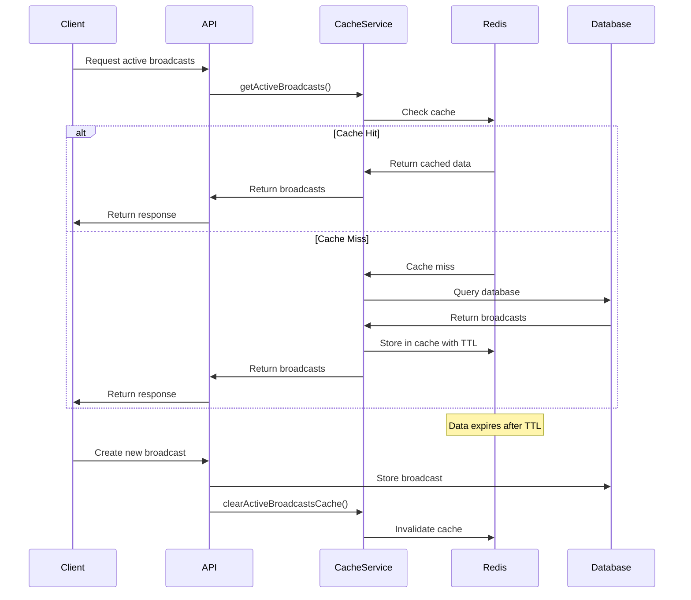

# Redis Caching

## Motivation

Imagine you're a librarian who keeps a small collection of the most frequently requested books on your desk, so you don't have to walk to the shelves every time someone asks for a popular title. This is essentially what caching does for our application.

In a high-volume messaging system that serves thousands or millions of users, repeatedly fetching the same data from the database creates unnecessary load and slows down response times. Redis caching solves this problem by storing frequently accessed data in memory, providing lightning-fast access and reducing database load.

## Core Explanation

Redis is an in-memory data structure store that our Broadcast Messaging System uses as a caching layer between the application and the database. It stores data in key-value pairs and supports various data structures like strings, hashes, lists, sets, and sorted sets.

In our system, Redis serves several critical functions:

1. **Connection Status Caching**: Tracks which users are currently connected via SSE, enabling quick lookups without database queries

2. **Active Broadcast Caching**: Stores currently active broadcasts to avoid repeated database access

4. **Statistics Caching**: Temporarily stores delivery statistics before periodic database updates

The caching strategy uses a combination of time-based expiration (TTL) and event-based invalidation to ensure data consistency while maximizing performance benefits.

## Code Examples

<details>
<summary>Redis Configuration</summary>

- **<mcsymbol name="RedisConfig" filename="RedisConfig.java" path="c:\Users\Srini\ws\Notification-SSE-GLM-Flux\broadcast-microservice\broadcast-shared\src\main\java\com\example\broadcast\shared\config\RedisConfig.java" startline="13" type="class"></mcsymbol>**: This class configures various `RedisTemplate` beans for different data types, setting up serializers for keys and values. TTLs for cached data are managed directly within the `CacheService` implementation.

```java
// Excerpt from RedisConfig.java
@Configuration
public class RedisConfig {

    @Bean
    public RedisTemplate<String, UserConnectionInfo> userConnectionInfoRedisTemplate(RedisConnectionFactory connectionFactory, ObjectMapper objectMapper) {
        RedisTemplate<String, UserConnectionInfo> template = new RedisTemplate<>();
        template.setConnectionFactory(connectionFactory);
        Jackson2JsonRedisSerializer<UserConnectionInfo> serializer = new Jackson2JsonRedisSerializer<>(objectMapper, UserConnectionInfo.class);
        template.setKeySerializer(new StringRedisSerializer());
        template.setValueSerializer(serializer);
        template.setHashKeySerializer(new StringRedisSerializer());
        template.setHashValueSerializer(serializer);
        return template;
    }

    @Bean
    public RedisTemplate<String, List<PersistentUserMessageInfo>> persistentUserMessagesRedisTemplate(RedisConnectionFactory connectionFactory, ObjectMapper objectMapper) {
        RedisTemplate<String, List<PersistentUserMessageInfo>> template = new RedisTemplate<>();
        template.setConnectionFactory(connectionFactory);
        
        JavaType type = objectMapper.getTypeFactory().constructCollectionType(List.class, PersistentUserMessageInfo.class);
        Jackson2JsonRedisSerializer<List<PersistentUserMessageInfo>> serializer = new Jackson2JsonRedisSerializer<>(objectMapper, type);

        template.setKeySerializer(new StringRedisSerializer());
        template.setValueSerializer(serializer);
        return template;
    }

    // ... other RedisTemplate bean configurations
}
```
</details>

<details>
<summary>Cache Service Implementation</summary>

`CacheService` is an interface, and <mcsymbol name="RedisCacheService" filename="RedisCacheService.java" path="c:\Users\Srini\ws\Notification-SSE-GLM-Flux\broadcast-microservice\broadcast-shared\src\main\java\com\example\broadcast\shared\service\cache\RedisCacheService.java" startline="20" type="class"></mcsymbol> is its concrete implementation, handling various caching operations with Redis. It manages user connection information, user messages, pending events, broadcast statistics, and active broadcasts, with TTLs applied directly within the service.

```java
// Excerpt from RedisCacheService.java
@Service
@RequiredArgsConstructor
@Slf4j
public class RedisCacheService implements CacheService {

    private final RedisTemplate<String, UserConnectionInfo> userConnectionInfoRedisTemplate;
    private final RedisTemplate<String, List<PersistentUserMessageInfo>> persistentUserMessagesRedisTemplate;
    private final RedisTemplate<String, List<PendingEventInfo>> pendingEventsRedisTemplate;
    private final RedisTemplate<String, UserConnectionInfo> userConnectionRedisTemplate;
    private final RedisTemplate<String, BroadcastStatsInfo> broadcastStatsRedisTemplate;
    private final RedisTemplate<String, BroadcastMessage> broadcastMessageRedisTemplate;
    private final RedisTemplate<String, List<BroadcastMessage>> activeGroupBroadcastsRedisTemplate;

    // ... other fields and methods

    @Override
    public void registerUserConnection(String userId, String connectionId, String podId) {
        UserConnectionInfo connectionInfo = new UserConnectionInfo(userId, connectionId, podId, ZonedDateTime.now(), ZonedDateTime.now());
        String userKey = USER_CONNECTION_KEY_PREFIX + userId;
        // TTL of 1 hour for user connection info
        userConnectionInfoRedisTemplate.opsForValue().set(userKey, connectionInfo, 1, TimeUnit.HOURS);
        stringRedisTemplate.opsForSet().add(ONLINE_USERS_KEY, userId);

        UserConnectionInfo connectionInfo = new UserConnectionInfo(userId, connectionId, podId, ZonedDateTime.now());
        String connectionKey = USER_CONNECTION_KEY_PREFIX + connectionId;
        // TTL of 30 minutes for user connection info
        userConnectionRedisTemplate.opsForValue().set(connectionKey, connectionInfo, 30, TimeUnit.MINUTES);
        log.debug("User connection and connection registered in Redis: {} on pod {}", userId, podId);
    }

    @Override
    public void cacheUserMessages(String userId, List<PersistentUserMessageInfo> messages) {
        // TTL of 24 hours for user messages
        persistentUserMessagesRedisTemplate.opsForValue().set(USER_MESSAGES_KEY_PREFIX + userId, messages, 24, TimeUnit.HOURS);
    }

    @Override
    public void cachePendingEvent(MessageDeliveryEvent event) {
        String key = PENDING_EVENTS_KEY_PREFIX + event.getUserId();
        PendingEventInfo pendingEvent = new PendingEventInfo(event.getEventId(), event.getBroadcastId(), event.getEventType(), event.getTimestamp(), event.getMessage());
        List<PendingEventInfo> pendingEvents = pendingEventsRedisTemplate.opsForValue().get(key);
        if (pendingEvents == null) {
            pendingEvents = new ArrayList<>();
        }
        pendingEvents.add(pendingEvent);
        // TTL of 6 hours for pending events
        pendingEventsRedisTemplate.opsForValue().set(key, pendingEvents, 6, TimeUnit.HOURS);
    }

    @Override
    public void cacheBroadcastStats(String statsKey, BroadcastStatsInfo stats) {
        // TTL of 5 minutes for broadcast statistics
        broadcastStatsRedisTemplate.opsForValue().set(BROADCAST_STATS_KEY_PREFIX + statsKey, stats, 5, TimeUnit.MINUTES);
    }

    // ... other methods
}
```
</details>

## Internal Walkthrough

Let's walk through how Redis caching works in our system:



1. **Cache Lookup**: When a service needs data, it first checks the Redis cache

2. **Cache Hit**: If the data is in the cache, it's returned immediately without a database query

3. **Cache Miss**: If the data isn't in the cache, it's fetched from the database, stored in the cache with a TTL, and then returned

4. **Cache Invalidation**: When data changes (e.g., a new broadcast is created), relevant cache entries are invalidated

5. **Automatic Expiration**: Data automatically expires after its TTL, ensuring stale data doesn't persist

## Redis Data Structures Usage

Our system leverages different Redis data structures for different caching needs:

1. **Sets** for connected users tracking (`SADD`, `SREM`, `SISMEMBER`, `SMEMBERS`)

2. **Hashes** for storing broadcast objects with fields (`HSET`, `HGETALL`)

3. **Sorted Sets** for time-ordered data like scheduled broadcasts (`ZADD`, `ZRANGE`)

4. **Strings** for simple key-value pairs like counters (`SET`, `GET`, `INCR`)

5. **Lists** for queue-like structures (`LPUSH`, `RPOP`)

## Cross-Linking

Redis Caching integrates with:

- [Server-Sent Events](02_server_sent_events.md) which uses Redis to track connected users
- [Database Schema Design](06_database_schema_design.md) which Redis caches to reduce load
- [User Connection Management](04_user_connection_management1.md) which heavily relies on Redis for connection storage


## Conclusion

Redis Caching is a critical component that significantly enhances the performance and scalability of our Broadcast Messaging System. By reducing database load and providing near-instantaneous access to frequently used data, Redis enables our system to handle high volumes of users and messages efficiently.

In the next chapter, we'll explore [Rate Limiting and Throttling](06_rate_limiting_and_throttling.md), which protects our system from abuse and ensures fair resource allocation among users.