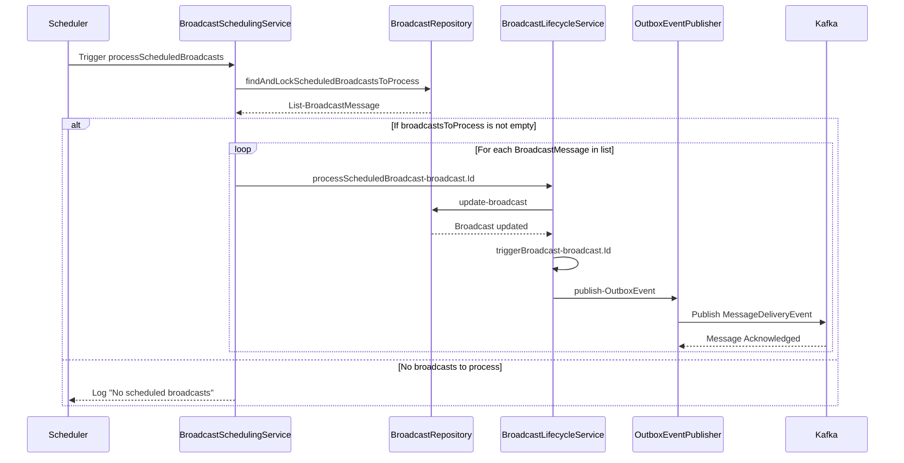
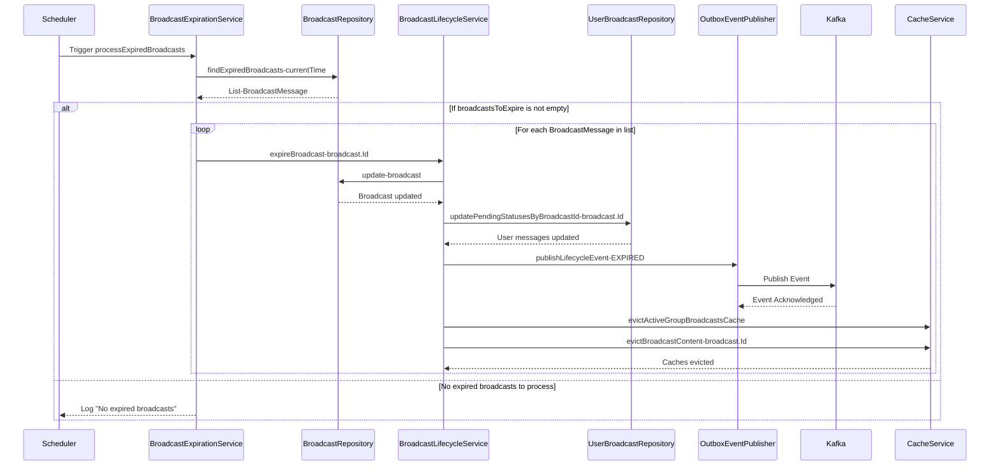

# Scheduler Flow

This document describes the scheduler flow within the Broadcast Messaging System, focusing on how scheduled broadcast messages are managed and delivered.

## Motivation

In a dynamic messaging environment, the ability to schedule messages for future delivery is a crucial feature. This allows administrators to:

- Prepare and queue messages in advance for specific events or times.
- Automate recurring announcements or notifications.
- Manage message delivery during off-peak hours to optimize system resources.

An efficient scheduler ensures that messages are delivered precisely when intended, without manual intervention, and that system resources are utilized effectively.

## Core Explanation

The scheduler flow involves several components working in concert to handle the lifecycle of a scheduled broadcast message:

- **Message Creation**: An administrator creates a broadcast message and specifies a future delivery time.
- **Persistence**: The scheduled message is stored in the database, marked as `SCHEDULED`.
- **Scheduler Service**: A dedicated service periodically queries the database for messages that are due for delivery.
- **Kafka Integration**: Once a message's scheduled time arrives, it is published to a Kafka topic for processing by consumers.
- **Status Updates**: The message's status is updated in the database (e.g., from `SCHEDULED` to `IN_PROGRESS` or `SENT`).

This design ensures decoupling between scheduling and delivery, leveraging Kafka for reliable, scalable message distribution.

## Code Examples

<details>
<summary>Scheduled Broadcast Message Entity</summary>

This entity represents a broadcast message with scheduling information.

```java
// Excerpt from BroadcastMessage.java (simplified)
@Entity
public class BroadcastMessage {
    @Id
    private String messageId;
    private String content;
    private ZonedDateTime scheduledTime;
    @Enumerated(EnumType.STRING)
    private BroadcastStatus status;

    // Getters, Setters, Constructors
}

public enum BroadcastStatus {
    DRAFT,
    SCHEDULED,
    IN_PROGRESS,
    SENT,
    CANCELLED
}
```
</details>

<details>
<summary>Scheduler Service Implementation</summary>

This service is responsible for finding and publishing scheduled messages.

```java
// Excerpt from BroadcastSchedulerService.java
@Service
@RequiredArgsConstructor
@Slf4j
public class BroadcastSchedulerService {

    private final BroadcastRepository broadcastRepository;
    private final KafkaTemplate<String, BroadcastMessage> kafkaTemplate;

    @Scheduled(fixedRate = 60000) // Run every 60 seconds
    public void processScheduledBroadcasts() {
        log.info("Checking for scheduled broadcasts...");
        ZonedDateTime now = ZonedDateTime.now();
        List<BroadcastMessage> scheduledMessages = broadcastRepository.findByStatusAndScheduledTimeBefore(
                BroadcastStatus.SCHEDULED, now
        );

        if (scheduledMessages.isEmpty()) {
            log.info("No scheduled broadcasts due at this time.");
            return;
        }

        log.info("Found {} scheduled broadcasts to process.", scheduledMessages.size());
        for (BroadcastMessage message : scheduledMessages) {
            try {
                // Update status to IN_PROGRESS before sending to Kafka
                message.setStatus(BroadcastStatus.IN_PROGRESS);
                broadcastRepository.save(message);

                kafkaTemplate.send("broadcast_messages", message.getMessageId(), message);
                log.info("Published scheduled message {} to Kafka.", message.getMessageId());

                // Update status to SENT after successful publishing
                message.setStatus(BroadcastStatus.SENT);
                broadcastRepository.save(message);
            } catch (Exception e) {
                log.error("Failed to publish scheduled message {}: {}", message.getMessageId(), e.getMessage());
                // Optionally, update status to FAILED or handle retry logic
            }
        }
    }
}
```
</details>

## Internal Walkthrough



1. **Message Scheduling**: An administrator uses the Admin UI to create a broadcast message and sets a `scheduledTime`.
2. **Database Persistence**: The `BroadcastAdminService` saves this message to the database with a `SCHEDULED` status.
3. **Scheduled Scan**: The `BroadcastSchedulerService` runs periodically (e.g., every minute) and queries the database for all messages with `SCHEDULED` status whose `scheduledTime` is in the past or present.
4. **Status Update & Publish**: For each found message, the scheduler first updates its status to `IN_PROGRESS` in the database, then publishes the message to the `broadcast_messages` Kafka topic. After successful publishing, the status is updated to `SENT`.
5. **Kafka Consumption**: Kafka consumers pick up these messages and proceed with the delivery process (e.g., via SSE).

## Cross-Linking

Scheduler Flow is closely integrated with:

- [Database Schema Design](06_database_schema_design.md) which defines the `broadcast_messages` table and its `scheduledTime` and `status` fields.
- [Kafka Event Streaming](03_kafka_event_streaming.md) as scheduled messages are published to Kafka for distribution.
- [Monitoring and Observability](08_monitoring_and_observability.md) for tracking scheduler performance and message delivery.

## Broadcast Expiration Flow

This sequence diagram illustrates the process of expiring broadcasts that have passed their `expiresAt` timestamp. The `BroadcastExpirationService` periodically checks for such broadcasts and updates their status.



## Other Scheduled Tasks

Beyond broadcast message scheduling, the system also includes other important scheduled tasks for maintenance and cleanup:

- **Stale SSE Connection Cleanup**: The `SseConnectionManager` includes a scheduled task to identify and clean up stale Server-Sent Events (SSE) connections across the cluster. This ensures that resources are not held indefinitely by disconnected or inactive clients.

<details>
<summary>Stale SSE Connection Cleanup</summary>

```java
// Excerpt from SseConnectionManager.java
@Scheduled(fixedRate = 60000)
@SchedulerLock(name = "cleanupStaleSseConnections", lockAtLeastFor = "PT55S", lockAtMostFor = "PT59S")
public void cleanupStaleConnections() {
    // Logic to find and remove stale connections
}
```
</details>

## Conclusion

The scheduler flow is a vital component of the Broadcast Messaging System, enabling automated and timely delivery of messages. By combining database persistence with Kafka's robust event streaming capabilities, and incorporating other essential cleanup tasks, we ensure a scalable and reliable mechanism for managing scheduled broadcasts and maintaining system health.