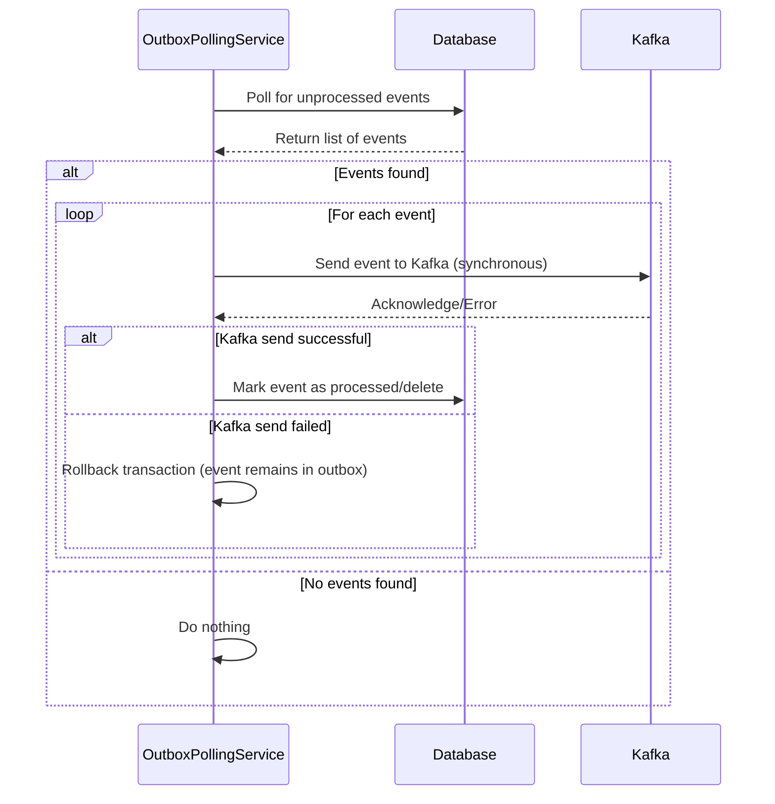
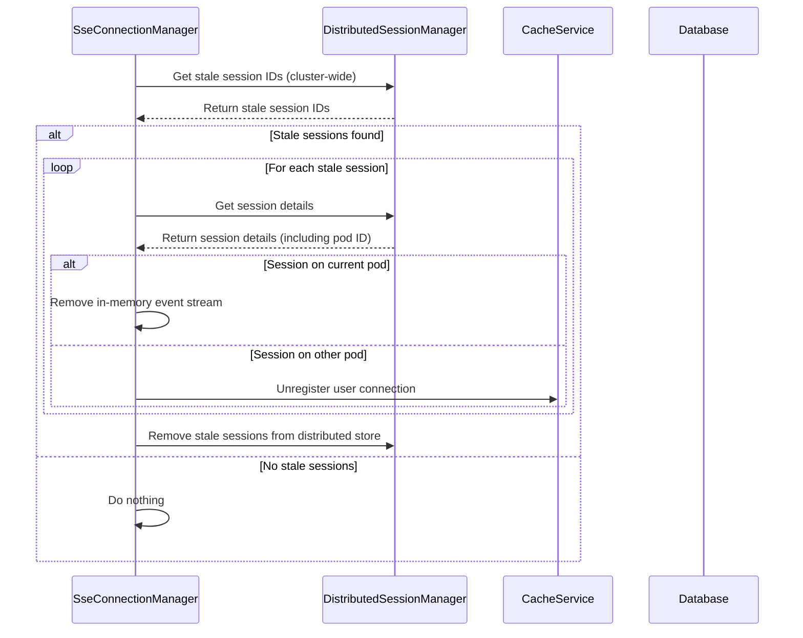
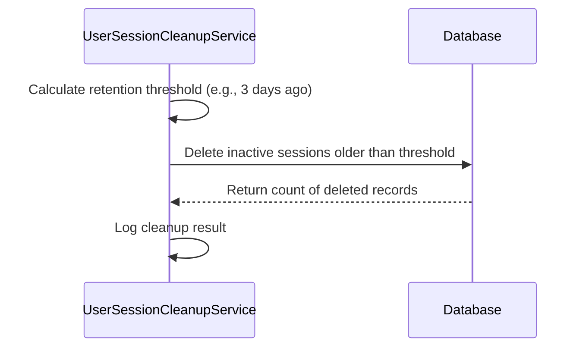
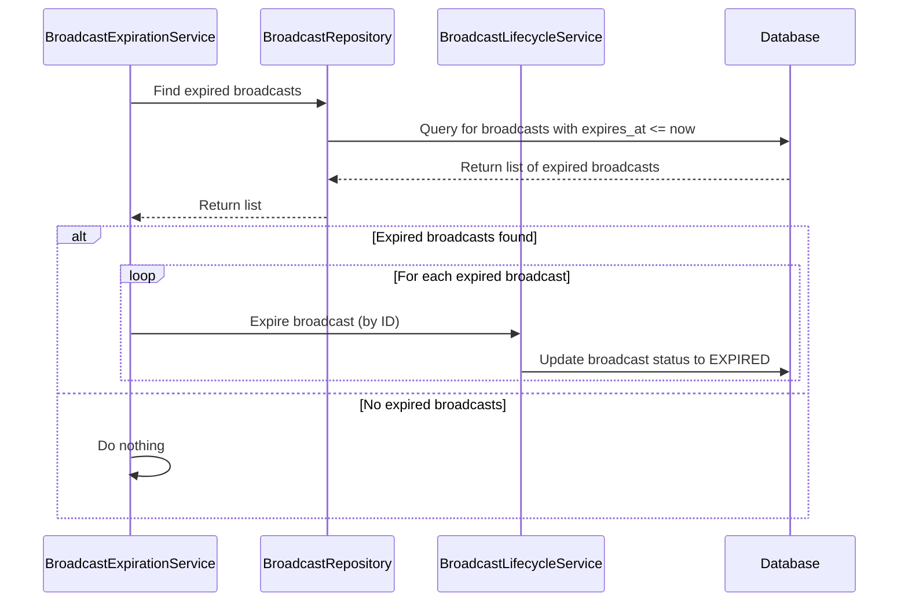
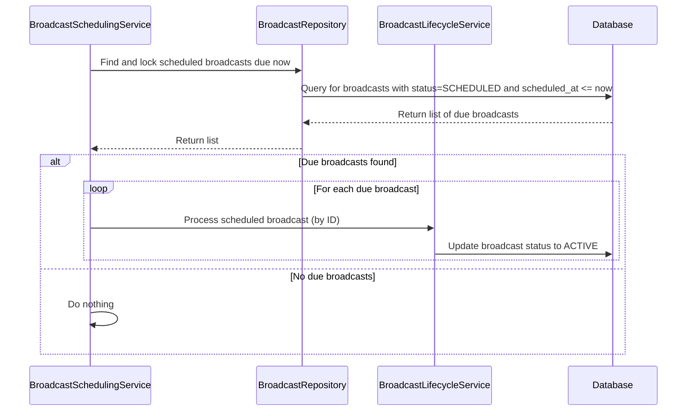

# Scheduler Management and Flows

This document outlines the various scheduled tasks within the Broadcast Microservice, their purpose, and how they are managed, especially in a distributed environment using ShedLock.

## Overview of Scheduled Tasks

The Broadcast Microservice utilizes Spring's `@Scheduled` annotation for recurring tasks. To ensure these tasks run correctly and avoid conflicts in a multi-instance deployment, ShedLock is employed for distributed locking.

## 1. Outbox Polling Service

-   **Purpose:** Polls the outbox table for unprocessed events and publishes them to Kafka. This ensures reliable message delivery even if the initial Kafka send fails.
-   **Frequency:** Every 2 seconds (`fixedDelay = 2000`).
-   **Implementation:** Uses `@Scheduled(fixedDelay = 2000)` and `@Transactional` to ensure atomicity of polling and publishing.

## 2. SSE Connection Manager - Stale Session Cleanup

-   **Purpose:** Periodically identifies and cleans up stale Server-Sent Event (SSE) sessions across the cluster. This ensures that inactive connections are properly closed and resources are released.
-   **Frequency:** Every 60 seconds (`fixedRate = 60000`).
-   **Distributed Lock:** `cleanupStaleSseSessions` using ShedLock (`lockAtLeastFor = "PT55S"`, `lockAtMostFor = "PT59S"`).
-   **Implementation:** Uses `@Scheduled(fixedRate = 60000)` and `@SchedulerLock`.

## 3. User Session Cleanup Service

-   **Purpose:** Purges old, inactive user sessions from the database to enforce data retention policies. This is a heavy deletion task.
-   **Frequency:** Daily at 2:00 AM (`cron = "0 0 2 * * *"`).
-   **Distributed Lock:** `purgeOldInactiveSessions` using ShedLock (`lockAtMostFor = "PT15M"`).
-   **Implementation:** Uses `@Scheduled(cron = "0 0 2 * * *")`, `@Transactional`, and `@SchedulerLock`.

## 4. Broadcast Expiration Service

-   **Purpose:** Periodically checks for active broadcasts that have passed their `expires_at` timestamp and marks them as expired.
-   **Frequency:** Every 60 seconds (`fixedRate = 60000`).
-   **Distributed Lock:** `processExpiredBroadcasts` using ShedLock (`lockAtLeastFor = "PT55S"`, `lockAtMostFor = "PT59S"`).
-   **Implementation:** Uses `@Scheduled(fixedRate = 60000)`, `@Transactional`, and `@SchedulerLock`.

## 5. Broadcast Scheduling Service

-   **Purpose:** Periodically processes broadcasts that were `SCHEDULED` for a future time and are now due. It transitions them to an `ACTIVE` state.
-   **Frequency:** Every 60 seconds (`fixedRate = 60000`).
-   **Distributed Lock:** `processScheduledBroadcasts` using ShedLock (`lockAtLeastFor = "PT55S"`, `lockAtMostFor = "PT59S"`).
-   **Implementation:** Uses `@Scheduled(fixedRate = 60000)`, `@Transactional(noRollbackFor = UserServiceUnavailableException.class)`, and `@SchedulerLock`.

This comprehensive overview covers the various scheduled operations critical to the Broadcast Microservice's functionality, from message delivery and session management to broadcast lifecycle handling, all orchestrated with robust distributed locking.