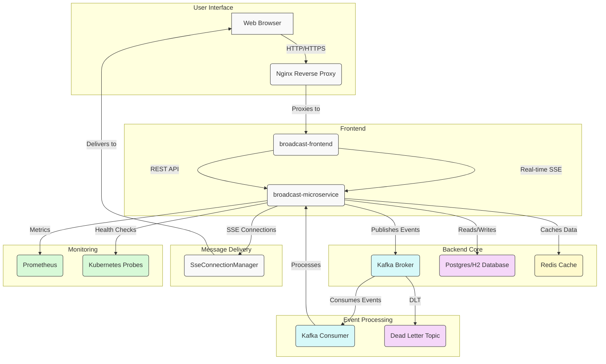

# Broadcast Messaging System - Microservice

Welcome to the documentation for the Broadcast Messaging System Microservice, a high-performance Java microservice built with Spring Boot and Netty for real-time message delivery.

## Project Overview

The Broadcast Messaging System is designed to handle high-scale operations with support for 400,000+ registered users and 30,000+ concurrent SSE connections. It provides real-time message delivery with sub-second latency for online users, persistent storage for message tracking, and a scalable architecture ready for Kubernetes deployment.

## Project Architecture

## Chapters

0. [React Frontend](00_react_frontend.md)
1. [Message Broadcasting System](01_message_broadcasting_system.md)
2. [Server-Sent Events (SSE)](02_server_sent_events.md)
3. [Kafka Event Streaming](03_kafka_event_streaming.md)
4. [User Connection Management](04_user_connection_management1.md)
5. [User Connection Management](04_user_connection_management2.md)
6. [Dead Letter Topic (DLT) Management](05_dlt_management.md)
7. [Database Schema Design](06_database_schema_design.md)
8. [Redis Caching](06_redis_caching.md)
9. [Scheduler Flow](07_scheduler_flow1.md)
10. [Scheduler Flow](07_scheduler_flow2.md)
