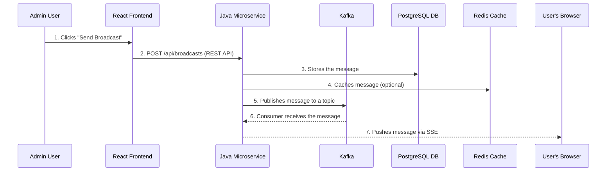

# Chapter 1: High-Level System Architecture

Welcome to the first chapter! Before we dive into the code, let's look at the project from a bird's-eye view. Understanding the main parts and how they talk to each other is the key to mastering any new system.

### Motivation: Why This Structure?

Imagine you're running a postal service. You have a front office where people drop off letters (the **Frontend**), a central sorting facility that figures out where everything goes (the **Backend Microservice**), and a fleet of mail trucks that deliver the letters (the **Messaging System**).

This project is structured just like that to separate concerns. Each part has one job and does it well, which makes the whole system reliable and easy to maintain.

### Core Explanation: The Main Components

Our system is built with a clear separation of concerns, organized into several key components that work together seamlessly:

1.  **React Frontend**: This is the user-facing part of our system. It's a modern web application that runs in your browser, providing two main interfaces: an "Admin Panel" for creating and managing broadcasts, and a "User Panel" for receiving real-time messages. It's like the dashboard and display screen of our notification system.
2.  **Java Microservice**: This is the powerful engine behind the scenes. Built with Spring Boot and WebFlux, it handles all the core business logic. It receives requests from the frontend, processes messages, interacts with the database, and pushes real-time updates to users. Think of it as the central control unit.
3.  **Kafka**: This is our high-speed, super-reliable messaging highway. Kafka acts as a distributed event streaming platform, ensuring that messages are queued, processed asynchronously, and delivered without loss. It's crucial for handling the flow of broadcast messages efficiently.
4.  **PostgreSQL Database**: This is the long-term memory of our system. All broadcast messages, user data, and system configurations are persistently stored here. It ensures that even if parts of our system go down, your data is safe and sound.
5.  **Redis Cache**: To make things lightning fast, we use Redis. It's an in-memory data store that acts as a super-speedy temporary storage for frequently accessed information, like active user connections or recently sent messages. This reduces the load on our main database and speeds up message delivery.

### Internal Walkthrough: How a Message Travels

Let's trace the journey of a single broadcast message from an Admin to a User.

1.  An **Admin** writes a message in the [React Frontend](02_react_frontend.md) and hits send.
2.  The frontend packages this into a standard `POST` request to the [Java Microservice](03_java_microservice.md).
3.  The microservice immediately saves the message to the **PostgreSQL Database** for long-term storage. For more details, see the [Database Integration](08_database_integration.md) chapter.
4.  It then optionally caches the message in **Redis** for quick retrieval.
5.  It then publishes the message to a **Kafka** topic. This decouples the sending from the delivery.
6.  A Kafka consumer within the same microservice listens for this message.
7.  Upon receiving it, the microservice finds all connected users and pushes the message to them in real-time using [Server-Sent Events (SSE)](04_server_sent_events.md).

### Conclusion

You now have a high-level map of the entire system! You know the main components and the path a message takes from sender to receiver.

Next, we'll zoom in on the first stop in this journey: the [React Frontend](02_react_frontend.md).
--- END OF FILE ---
