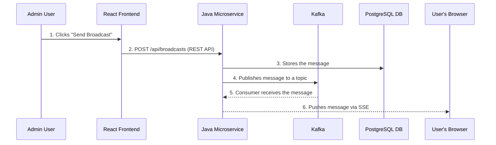

# Chapter 1: High-Level System Architecture

Welcome to the first chapter! Before we dive into the code, let's look at the project from a bird's-eye view. Understanding the main parts and how they talk to each other is the key to mastering any new system.

### Motivation: Why This Structure?

Imagine you're running a postal service. You have a front office where people drop off letters (the **Frontend**), a central sorting facility that figures out where everything goes (the **Backend Microservice**), and a fleet of mail trucks that deliver the letters (the **Messaging System**).

This project is structured just like that to separate concerns. Each part has one job and does it well, which makes the whole system reliable and easy to maintain.

### Core Explanation: The Main Components

Our system has three main layers:

1.  **React Frontend**: This is what users see and interact with. It's the web application that runs in the browser, providing an "Admin Panel" to send broadcasts and a "User Panel" to receive them.
2.  **Java Microservice**: This is the brain of the operation. It handles requests from the frontend, manages the business logic (like storing messages), and pushes updates to users.
3.  **Kafka & Database**: This is the infrastructure backbone. Kafka acts as the high-speed mail-sorting system that queues up messages, while the PostgreSQL database is the long-term archive for all sent messages.

### Internal Walkthrough: How a Message Travels

Let's trace the journey of a single broadcast message from an Admin to a User.

1.  An **Admin** writes a message in the [React Frontend](02_react_frontend.md) and hits send.
2.  The frontend packages this into a standard `POST` request to the [Java Microservice](03_java_microservice.md).
3.  The microservice immediately saves the message to the **PostgreSQL Database** for long-term storage.
4.  It then publishes the message to a **Kafka** topic. This decouples the sending from the delivery.
5.  A Kafka consumer within the same microservice listens for this message.
6.  Upon receiving it, the microservice finds all connected users and pushes the message to them in real-time using [Server-Sent Events (SSE)](04_server_sent_events.md).

### Conclusion

You now have a high-level map of the entire system! You know the main components and the path a message takes from sender to receiver.

Next, we'll zoom in on the first stop in this journey: the [React Frontend](02_react_frontend.md).
--- END OF FILE ---
