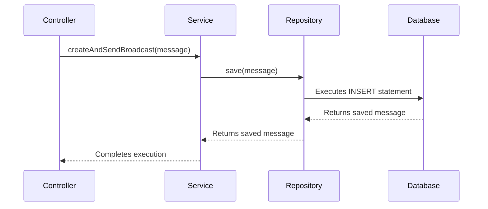

# Chapter 3: The Java Microservice

Behind the sleek frontend is the powerful backend: a Java microservice built with the Spring Boot framework. This is the central hub that drives the entire application's logic.

### Motivation: The Central Command Center

Think of the microservice as the "central command" of our broadcast system. It receives orders (API requests) from the frontend, makes decisions, and coordinates with other units like the database and the messaging system (Kafka). It's responsible for everything the user *doesn't* see.

### Core Explanation: Controllers, Services, and Repositories

The Java microservice follows a classic three-layer architecture pattern, which helps keep the code organized and easy to understand.

1.  **Controller (`@RestController`)**: This is the front door for all incoming API requests. Its job is to receive a request, validate it, and pass it to the appropriate service. You'll find these in the `com.example.broadcast.controller` package.
2.  **Service (`@Service`)**: This is where the business logic lives. Services coordinate tasks, like saving a message to the database and then publishing it to Kafka. They are the "brains" of the operation, located in `com.example.broadcast.service`.
3.  **Repository (`@Repository`)**: This layer is responsible for all communication with the database. It provides a simple way to create, read, update, and delete records without writing raw SQL. Find these in `com.example.broadcast.repository`.

### Code Example: Creating a Broadcast

Let's look at a simplified version of the `BroadcastController`. It shows how an incoming request is handled and passed down to the service layer.

```java
// Location: broadcast-microservice/src/main/java/com/example/broadcast/controller/BroadcastController.java

@RestController
@RequestMapping("/api/broadcasts")
public class BroadcastController {

    @Autowired
    private BroadcastService broadcastService;

    @PostMapping
    public ResponseEntity<Void> createBroadcast(@RequestBody BroadcastMessage message) {
        // 1. Receives the HTTP request
        // 2. Delegates the logic to the BroadcastService
        broadcastService.createAndSendBroadcast(message);
        return ResponseEntity.status(HttpStatus.CREATED).build();
    }
}
```
Notice how the controller doesn't know *how* the broadcast is sent; it only knows that it needs to call the `broadcastService`. This separation is key.

### Internal Walkthrough: From Controller to Database

This diagram shows how the three layers work together to handle a single request.


This clear, one-way flow of control (Controller -> Service -> Repository) makes the application predictable and easy to debug.

### Conclusion

The Java microservice is the robust and organized core of our system. Its layered architecture ensures that business logic, API handling, and database interactions are all neatly separated.

Next up, we'll look at the specific technology that enables real-time communication between this microservice and the user's browser: [Server-Sent Events (SSE)](04_server_sent_events.md).
--- END OF FILE ---
