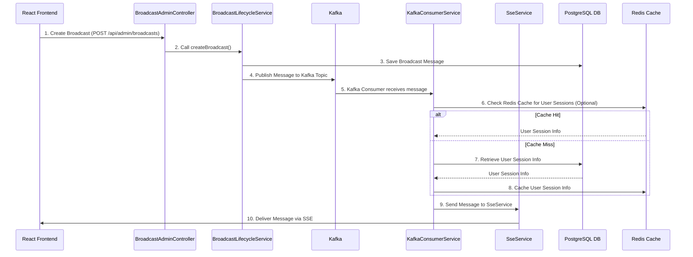

# 03. Java Microservice - The Backend Powerhouse

## Motivation

The Java Microservice serves as the robust backend for the Broadcast Messaging System. Built with Spring Boot and leveraging reactive programming with WebFlux, it's designed for high throughput, low latency, and scalability. Its primary responsibilities include:

- **Broadcast Management**: Handling the creation, scheduling, and delivery of broadcast messages.
- **Real-time Communication**: Managing [Server-Sent Events (SSE)](05_server_sent_events.md) connections for real-time message delivery to connected users.
- **Event Streaming**: Integrating with Apache Kafka for reliable and asynchronous message processing.
- **Data Persistence**: Storing broadcast and user-related data in PostgreSQL.
- **Caching**: Utilizing Caffeine and Redis for efficient data retrieval and session management.

## Core Components and Technologies

The microservice is a Spring Boot application that heavily relies on the following key technologies:

- **Spring WebFlux**: For building reactive, non-blocking web applications, enabling efficient handling of concurrent requests, especially for SSE.
- **Apache Kafka**: As a distributed streaming platform for publishing and subscribing to streams of records, ensuring reliable message delivery and processing.
- **Spring Data JPA / R2DBC**: For interacting with the PostgreSQL database.
- **Redis**: For distributed caching and managing user sessions across multiple instances.
- **Caffeine**: For in-memory caching.
- **Project Reactor**: The foundation for reactive programming in Spring WebFlux.
- **Lombok**: To reduce boilerplate code.
- **Resilience4j**: For fault tolerance, including rate limiting and circuit breaking.

## Key Controllers and Services

Let's explore some of the critical components that drive the Java Microservice.

### `BroadcastAdminController.java`

This controller exposes RESTful endpoints for administrative tasks related to broadcast messages. It allows for creating, retrieving, updating, and deleting broadcasts, as well as fetching statistics and delivery details.

```java
// broadcast-microservice/src/main/java/com/example/broadcast/admin/controller/BroadcastAdminController.java

// ... existing code ...

@RestController
@RequestMapping("/api/admin/broadcasts")
@RequiredArgsConstructor
@Slf4j
public class BroadcastAdminController {

    private final BroadcastLifecycleService broadcastLifecycleService;
    private final BroadcastQueryService broadcastQueryService;
    private final UserService userService;

    @PostMapping
    @RateLimiter(name = "createBroadcastLimiter")
    public ResponseEntity<BroadcastResponse> createBroadcast(
            @Valid @RequestBody BroadcastRequest request) {
        log.info("Received broadcast creation request from sender: {}", request.getSenderId());
        BroadcastResponse response = broadcastLifecycleService.createBroadcast(request);
        log.info("Broadcast created successfully with ID: {}", response.getId());
        return ResponseEntity.ok(response);
    }

    @GetMapping("/{id}")
    public ResponseEntity<BroadcastResponse> getBroadcast(@PathVariable Long id) {
        log.info("Admin retrieving broadcast with ID: {}", id);
        BroadcastResponse response = broadcastQueryService.getBroadcast(id);
        return ResponseEntity.ok(response);
    }

    // ... other endpoints for managing broadcasts ...

}
```

### `SseController.java`

This controller is responsible for establishing and managing Server-Sent Events (SSE) connections with the frontend. It allows users to subscribe to a real-time stream of messages.

```java
// broadcast-microservice/src/main/java/com/example/broadcast/user/controller/SseController.java

// ... existing code ...

@RestController
@RequestMapping("/api/sse")
@RequiredArgsConstructor
@Slf4j
public class SseController {

    private final SseService sseService;
    private final UserMessageService userMessageService;
    private final DistributedSessionManager sessionManager;
    private final AppProperties appProperties;

    @GetMapping(value = "/connect", produces = MediaType.TEXT_EVENT_STREAM_VALUE)
    @RateLimiter(name = "sseConnectLimiter", fallbackMethod = "connectFallback")
    public Flux<ServerSentEvent<String>> connect(
            @RequestParam String userId,
            @RequestParam(required = false) String sessionId,
            ServerWebExchange exchange) {

        log.info("SSE connection request from user: {}, session: {}, IP: {}",
                 userId, sessionId, exchange.getRequest().getRemoteAddress() != null ? exchange.getRequest().getRemoteAddress().getAddress().getHostAddress() : "unknown");

        if (sessionId == null || sessionId.trim().isEmpty()) {
            sessionId = UUID.randomUUID().toString();
        }

        sseService.registerConnection(userId, sessionId);
        Flux<ServerSentEvent<String>> eventStream = sseService.createEventStream(userId, sessionId);
        log.info("SSE connection established for user: {}, session: {}", userId, sessionId);
        return eventStream;
    }

    @PostMapping("/disconnect")
    public ResponseEntity<String> disconnect(
            @RequestParam String userId,
            @RequestParam String sessionId) {

        log.info("Disconnect request from user: {}, session: {}", userId, sessionId);
        sseService.removeEventStream(userId, sessionId);
        return ResponseEntity.ok("Disconnected successfully");
    }

    // ... other endpoints for SSE management and stats ...

}
```

### `BroadcastLifecycleService.java`

This service orchestrates the lifecycle of a broadcast message, from creation to delivery. It interacts with repositories for persistence and Kafka for event publishing.

### `SseService.java`

Manages the Server-Sent Events connections, including registering new connections, sending messages to connected clients, and handling disconnections.

### `KafkaConsumerService.java`

Responsible for consuming messages from Kafka topics, processing them, and delivering them to the appropriate users via SSE.

## Message Flow within the Microservice

The following diagram illustrates a simplified flow of a broadcast message being created and then delivered to users through the Java Microservice:



1.  **Create Broadcast**: The React Frontend sends a request to the `BroadcastAdminController` to create a new broadcast message.
2.  **Call `createBroadcast()`**: The controller delegates the request to the `BroadcastLifecycleService`.
3.  **Save Broadcast Message**: The `BroadcastLifecycleService` persists the broadcast message details in the PostgreSQL database.
4.  **Publish to Kafka**: The `BroadcastLifecycleService` publishes the newly created broadcast message to a Kafka topic for asynchronous processing.
5.  **Kafka Consumer Receives Message**: The `KafkaConsumerService` consumes the message from the Kafka topic.
6.  **Check Redis Cache for User Sessions**: The `KafkaConsumerService` first checks Redis for active user session information to determine which users are connected and should receive the message.
7.  **Retrieve User Session Info (Cache Miss)**: If the user session information is not found in Redis (cache miss), it retrieves the necessary details from the PostgreSQL database.
8.  **Cache User Session Info**: The retrieved user session information is then cached in Redis for faster access in subsequent requests.
9.  **Send Message to `SseService`**: The `KafkaConsumerService` then passes the message and relevant user session information to the `SseService`.
10. **Deliver Message via SSE**: The `SseService` delivers the broadcast message in real-time to the connected React Frontend clients via Server-Sent Events.
