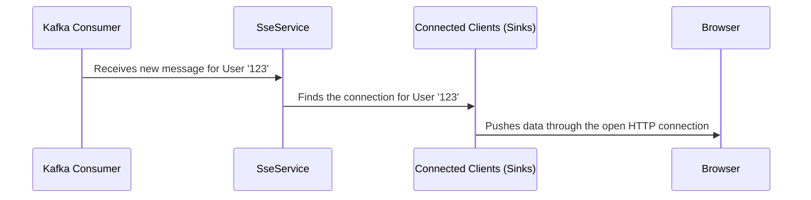

# Chapter 4: Real-time Magic: Server-Sent Events (SSE)

How do messages appear on the user's screen instantly without them needing to refresh the page? The answer is Server-Sent Events, or SSE. This is the technology that enables the "real-time" aspect of our application.

### Motivation: A Live News Feed

Imagine you're watching a live news ticker. You don't have to keep asking, "Is there any new news?" Instead, the news station pushes updates to your screen as they happen.

SSE works exactly like that. The user's browser opens a persistent, one-way connection to the server. The server can then "push" data down to the browser whenever it wants. This is far more efficient than the browser constantly polling the server for updates.

### Core Explanation: A One-Way Street

SSE is a standard web technology that allows a server to send data to a client asynchronously. Here's how it fits into our system:

1.  **The Connection**: When the [React Frontend](02_react_frontend.md) loads, it makes a special request to an SSE endpoint on the [Java Microservice](03_java_microservice.md).
2.  **The Open Line**: Unlike a normal API request that closes after getting a response, this connection stays open.
3.  **The Push**: When the backend has a new message to deliver (after getting it from Kafka), it simply writes that message into the open connection. The browser receives it instantly.

### Code Example: Subscribing to Events on the Frontend

The frontend uses the browser's built-in `EventSource` API to connect to the SSE stream. This is managed by the `useSseConnection` hook.

```typescript
// Location: broadcast-frontend/src/hooks/useSseConnection.ts

useEffect(() => {
  // The URL of our backend's SSE endpoint
  const eventSource = new EventSource(`${API_BASE_URL}/api/sse/subscribe/${userId}`);

  // This function runs every time a message arrives
  eventSource.onmessage = (event) => {
    const newMessage = JSON.parse(event.data);
    addMessage(newMessage); // Add the message to our local state
  };

  // Clean up the connection when the component unmounts
  return () => {
    eventSource.close();
  };
}, [userId]);
```
This code sets up a listener that waits for `message` events from the server and updates the UI accordingly.

### Internal Walkthrough: The Server-Side Push

On the Java backend, there's a corresponding controller that handles these SSE connections. It keeps a list of all connected clients.



When the `SseService` needs to send a message, it looks up the correct client's connection (called a "Sink" in reactive programming) and emits the data.

### Conclusion

Server-Sent Events are the secret sauce behind our application's real-time capabilities. It provides a simple yet powerful way for the server to push updates to clients instantly. This one-way communication channel is perfect for applications like live notifications, news feeds, or status updates.

Next, we'll look at the system that feeds these messages to the SSE service: the [Kafka Integration](05_kafka_integration.md).
--- END OF FILE ---
