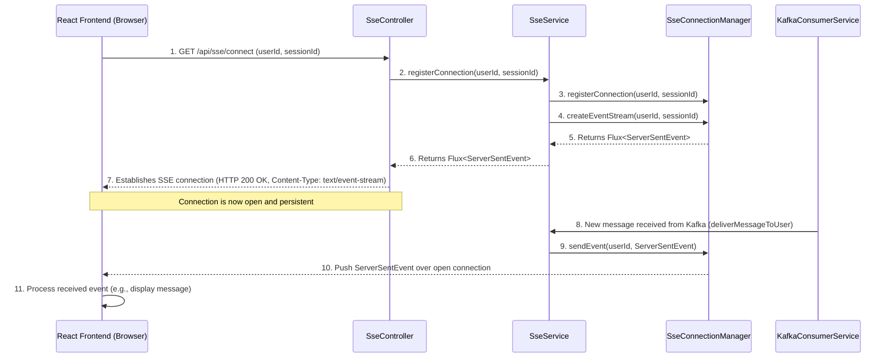

# Chapter 4: Server-Sent Events (SSE) - Real-time Communication

## Motivation

In a broadcast messaging system, real-time updates are crucial. Users need to receive new messages as soon as they are published, without constantly refreshing their browser. Server-Sent Events (SSE) provide an efficient and straightforward way to achieve this one-way, server-to-client communication over a single HTTP connection.

Unlike WebSockets, which offer full-duplex communication, SSE is simpler to implement when you only need to push data from the server to the client. This makes it ideal for scenarios like news feeds, stock tickers, or, in our case, broadcasting messages.

## Core Concepts

- **One-way Communication**: Data flows only from the server to the client.
- **Persistent Connection**: The client establishes a long-lived HTTP connection with the server.
- **Event Stream**: The server sends a stream of events over this connection. Each event has a type, an optional ID, and data.
- **Automatic Reconnection**: Browsers automatically attempt to reconnect if the connection is dropped.
- **Simplicity**: Easier to implement and manage than WebSockets for server-to-client push.

## Implementation in the Java Microservice

The Java Microservice leverages Spring WebFlux to implement SSE, providing a reactive and non-blocking approach to handling numerous concurrent connections.

### `SseController.java`

As seen in the previous chapter, the `SseController` is the entry point for clients to establish an SSE connection. The `/api/sse/connect` endpoint returns a `Flux<ServerSentEvent<String>>`, which is Spring WebFlux's way of representing a stream of events.

```java
// broadcast-microservice/src/main/java/com/example/broadcast/user/controller/SseController.java

// ... existing code ...

@RestController
@RequestMapping("/api/sse")
@RequiredArgsConstructor
@Slf4j
public class SseController {

    private final SseService sseService;
    // ... other dependencies ...

    @GetMapping(value = "/connect", produces = MediaType.TEXT_EVENT_STREAM_VALUE)
    @RateLimiter(name = "sseConnectLimiter", fallbackMethod = "connectFallback")
    public Flux<ServerSentEvent<String>> connect(
            @RequestParam String userId,
            @RequestParam(required = false) String sessionId,
            ServerWebExchange exchange) {

        // ... logging and session ID generation ...

        sseService.registerConnection(userId, sessionId);
        Flux<ServerSentEvent<String>> eventStream = sseService.createEventStream(userId, sessionId);
        log.info("SSE connection established for user: {}, session: {}", userId, sessionId);
        return eventStream;
    }

    // ... disconnect and stats endpoints ...

}
```

### `SseService.java`

This service manages the lifecycle of SSE connections and the delivery of messages. It uses an `SseConnectionManager` to keep track of active connections and provides methods to send events to specific users.

```java
// broadcast-microservice/src/main/java/com/example/broadcast/user/service/SseService.java

// ... existing code ...

@Service
@Slf4j
@RequiredArgsConstructor
public class SseService {

    private final SseConnectionManager sseConnectionManager;
    private final ObjectMapper objectMapper;
    private final CacheService cacheService;
    private final UserBroadcastRepository userBroadcastRepository;
    private final BroadcastRepository broadcastRepository;
    private final MessageStatusService messageStatusService;
    private final BroadcastMapper broadcastMapper;

    @Transactional
    public void registerConnection(String userId, String sessionId) {
        sseConnectionManager.registerConnection(userId, sessionId);
    }
    
    public Flux<ServerSentEvent<String>> createEventStream(String userId, String sessionId) {
        log.info("Orchestrating event stream creation for user: {}, session: {}", userId, sessionId);
        Flux<ServerSentEvent<String>> eventStream = sseConnectionManager.createEventStream(userId, sessionId);

        sendPendingMessages(userId); // Send any messages that arrived while user was disconnected
        try {
            String connectedPayload = objectMapper.writeValueAsString(Map.of("message", "SSE connection established with session " + sessionId));
            sseConnectionManager.sendEvent(userId, ServerSentEvent.<String>builder()
                .event(SseEventType.CONNECTED.name())
                .data(connectedPayload)
                .build());
        } catch (JsonProcessingException e) {
            log.error("Error creating CONNECTED event", e);
        }
        
        return eventStream;
    }

    // ... handleMessageEvent, deliverMessageToUser, etc. ...

    public void deliverMessageToUser(String userId, Long broadcastId) {
        // Logic to fetch message, build SSE event, and send via sseConnectionManager
        // Also updates message status and caches delivered messages
    }

}
```

### `SseConnectionManager.java`

This class (not shown in detail here, but a key component) is responsible for holding the actual `Flux` sinks for each connected user and session. When `SseService` wants to send a message, it calls `sseConnectionManager.sendEvent()`, which then pushes the `ServerSentEvent` to the appropriate `Flux` sink, sending it over the established HTTP connection to the client.

## SSE Message Flow

Here's how an SSE connection is established and how messages are pushed from the server to the client:



1.  **Client Connects**: The React Frontend (browser) makes a GET request to the `/api/sse/connect` endpoint, providing a `userId` and an optional `sessionId`.
2.  **Register Connection**: The `SseController` delegates to the `SseService` to register this new connection.
3.  **Manage Connection**: The `SseService` uses `SseConnectionManager` to store the connection details and create a `Flux` sink for this specific user and session.
4.  **Establish Stream**: The `Flux` is returned up the call stack to the `SseController`, which then returns it to the browser. This establishes the persistent SSE connection.
5.  **Server Pushes Message**: When a new broadcast message arrives (e.g., from Kafka, processed by `KafkaConsumerService`), the `KafkaConsumerService` calls `SseService.deliverMessageToUser()`.
6.  **Send Event**: The `SseService` constructs a `ServerSentEvent` and uses `SseConnectionManager.sendEvent()` to push this event to the `Flux` sink associated with the target `userId`.
7.  **Client Receives**: The browser, which has the SSE connection open, receives the `ServerSentEvent` and processes its data, typically updating the UI in real-time.
