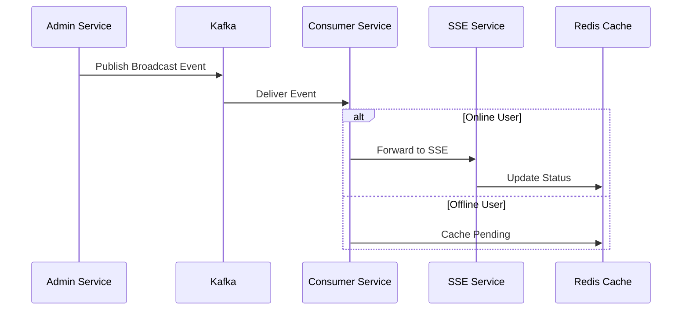

# 05. Kafka Integration

## Motivation
Kafka serves as the event streaming backbone of our broadcast system, enabling reliable message delivery and fault tolerance through its distributed architecture. It handles both broadcast creation events and status updates (read/cancelled/expired) with built-in retry mechanisms via Dead Letter Topics (DLT).

## Core Components
1. **Kafka Configuration** (<mcfile name="KafkaConfig.java" path="broadcast-microservice/src/main/java/com/example/broadcast/shared/config/KafkaConfig.java"></mcfile>)
   - Producer/Consumer factories with JSON serialization
   - Error handling with dead letter topics
   - Topic configuration with partitions and replication
   - Custom backoff and retry policies

2. **Kafka Consumer Service** (<mcfile name="KafkaConsumerService.java" path="broadcast-microservice/src/main/java/com/example/broadcast/user/service/KafkaConsumerService.java"></mcfile>)
   - Processes messages from both all-users and selected-users topics
   - Handles transient failures with automatic retries
   - Integrates with SSE and caching systems

## Key Features
- **Dual Topic Strategy**: Separate topics for all-users and selected-users broadcasts
- **Dead Letter Topics**: Automatic routing of failed messages to DLTs with extended retention
- **Transient Failure Handling**: Automatic retry mechanism for temporary failures
- **Exactly-Once Semantics**: Manual offset management with acknowledgment

## Sequence Flow
