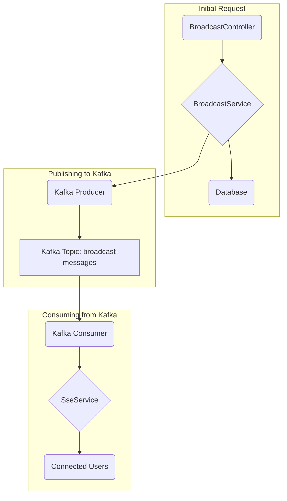

# Chapter 5: The Backbone: Kafka Integration

How does our system ensure that every message is processed reliably, even under heavy load? The answer is Apache Kafka, a powerful event streaming platform that acts as the central nervous system for our application.

### Motivation: A Resilient Postal System

Imagine our postal service again. If the sorting facility gets overwhelmed with letters, it can't just throw them away. Instead, it needs a conveyor belt system that can hold all the incoming mail, process it in order, and ensure nothing gets lost.

Kafka is that conveyor belt. It's a message queue that can handle a massive volume of events (messages). The [Java Microservice](03_java_microservice.md) places messages onto the queue (produces) and, in a separate process, picks them up for delivery (consumes). This makes the system incredibly resilient and scalable.

### Core Explanation: Producers, Consumers, and Topics

Working with Kafka involves three main concepts:

1.  **Topic**: A named stream of events. Think of it as a specific category or mailbox. We have a topic called `broadcast-messages` where all new broadcasts are sent.
2.  **Producer**: A component that writes messages to a Kafka topic. In our app, the `BroadcastService` acts as a producer when an admin first creates a message.
3.  **Consumer**: A component that reads messages from a Kafka topic. We have a `KafkaConsumerService` that listens to the `broadcast-messages` topic and triggers the [SSE](04_server_sent_events.md) push.

This producer/consumer pattern decouples the act of *creating* a message from the act of *delivering* it.

### Code Example: Producing a Message

When a broadcast is created, the service sends it to Kafka. Spring Boot makes this incredibly simple with `KafkaTemplate`.

```java
// Location: broadcast-microservice/src/main/java/com/example/broadcast/service/BroadcastService.java

@Service
public class BroadcastService {

    @Autowired
    private KafkaTemplate<String, String> kafkaTemplate;
    private static final String TOPIC = "broadcast-messages";

    public void sendToKafka(BroadcastMessage message) {
        // Convert the message to a string (e.g., JSON)
        String messageJson = convertToJson(message);
        // Send it to the 'broadcast-messages' topic
        kafkaTemplate.send(TOPIC, messageJson);
    }
}
```
The service doesn't need to know who is listening or how many consumers there are. It just fires the event into the void, trusting Kafka to handle it.

### Internal Walkthrough: The Kafka Flow


This flow shows the clear separation. The initial HTTP request is handled and stored, and then the message is handed off to Kafka. A completely separate part of the application picks it up from there to handle the real-time delivery.

### Conclusion

Kafka is the scalable and resilient backbone of our messaging system. By using a producer/consumer model, we decouple message creation from message delivery, allowing our application to handle high throughput and ensuring no messages are lost.

But what happens when a message *can't* be processed correctly? For that, we have a safety net, which we'll explore in the final chapter: [DLT Management](06_dlt_management.md).
--- END OF FILE ---
