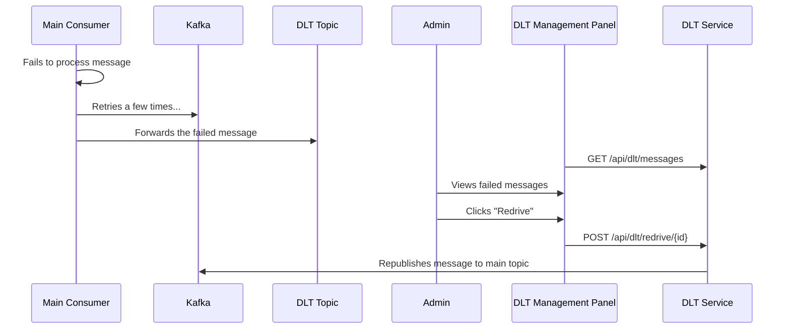

# Chapter 6: Handling Failure: DLT Management

In a perfect world, every message we send would be processed successfully. But in the real world, things can go wrong. A downstream service might be temporarily unavailable, a message might be malformed, or a bug could cause an unexpected error. What do we do then? We use a Dead Letter Topic (DLT).

### Motivation: The "Return to Sender" Pile

Think of a DLT as the "return to sender" pile at a post office. If a letter is undeliverable for some reason (bad address, etc.), you don't just throw it away. You set it aside in a special pile so a postal worker can examine it later and decide what to do.

A Dead Letter Topic (sometimes called a Dead Letter Queue or DLQ) is a safety net for our [Kafka Integration](05_kafka_integration.md). When our consumer fails to process a message after a few retries, it sends the message to the DLT.

### Core Explanation: The DLT Panel

This application provides a dedicated **DLT Management Panel** in the UI. This allows an administrator to:

1.  **View**: See all the messages that have failed.
2.  **Redrive**: Manually retry processing a message. This is useful if the error was temporary.
3.  **Delete/Purge**: Remove a message from the queue if it's unrecoverable.

This gives administrators full control over handling failures, ensuring that no message is permanently lost without manual intervention.

### Code Example: The DLT Consumer

On the backend, we have a special Kafka listener that consumes from the DLT. Spring for Kafka makes it easy to designate a DLT for a primary listener.

```java
// Location: broadcast-microservice/src/main/java/com/example/broadcast/service/KafkaConsumerService.java

@KafkaListener(topics = "broadcast-messages", groupId = "group_id")
public void consume(String message) {
    try {
        // Main logic to process the message
        processMessage(message);
    } catch (Exception e) {
        // If this fails, Spring will automatically send it to the DLT
        throw new RuntimeException("Failed to process message", e);
    }
}

// A separate listener for the DLT itself
@KafkaListener(topics = "broadcast-messages.DLT", groupId = "group_id")
public void dltListen(String message) {
    // Logic to handle a DLT message, like saving it to a separate DB table
    log.error("Received message in DLT: " + message);
    saveToDltTable(message);
}
```
The framework handles the "move to DLT" logic automatically. We just need to create a listener to handle the messages that end up there.

### Internal Walkthrough: From Failure to Resolution



This flow empowers an administrator to inspect and act on failures, creating a robust and transparent system.

### Conclusion

Congratulations, you've reached the end of the tutorial!

You now understand the entire Broadcast Messaging System, from the [high-level architecture](01_system_architecture.md) to the [React frontend](02_react_frontend.md), the [Java backend](03_java_microservice.md), the [real-time SSE communication](04_server_sent_events.md), the [resilient Kafka backbone](05_kafka_integration.md), the essential DLT safety net, the [caching strategies](07_caching_integration.md), the [database integration](08_database_integration.md), and the [deployment strategies](09_deployment.md).

We hope this gives you a solid foundation for working with and building upon this project.
--- END OF FILE ---
