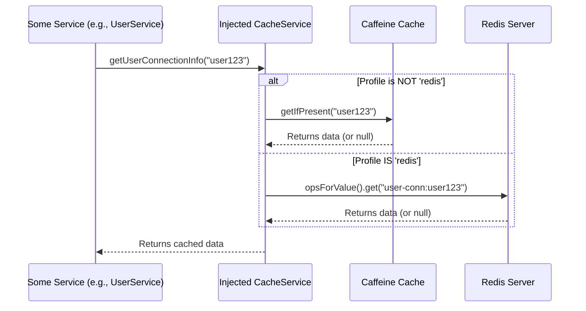

# Chapter 7: High-Speed Operations: Caching Integration

In any high-performance system, speed is critical. Constantly fetching data from a database can be slow and expensive. To solve this, our application uses a powerful caching layer to store frequently accessed data in memory, making lookups nearly instantaneous.

### Motivation: A Librarian's Desk

Imagine a library where the librarian keeps the most popular books on their desk instead of running to the shelves every time someone asks for them. This is exactly what caching does for our application. It keeps important information—like user session data or recently sent messages—in a fast, temporary storage area.

Our system is extra clever and uses a **dual-strategy** approach to caching, which we'll explore below.

### Core Explanation: Two Strategies for Caching

The application can switch between two different caching implementations, chosen based on the environment it's running in. This is controlled by **Spring Profiles**.

1.  **Caffeine (Default)**: For simple, single-instance deployments, the system uses Caffeine, an incredibly fast in-memory cache. Think of this as a single librarian with their own desk. It's highly efficient but not shared with other librarians. This is the default behavior.

2.  **Redis (Profile: `redis`)**: For scalable, multi-instance deployments (like in Kubernetes), the system uses Redis. Redis is a **distributed cache**, meaning all instances of the backend service connect to a central Redis server to share the cached data. This is like a central, super-fast reference desk that all librarians can use. This is activated by running the application with the `redis` profile.

### Code Example 1: Caffeine Configuration

The `CaffeineConfig.java` file defines multiple `Cache` beans. Each cache is tailored for a specific type of data with its own size and expiration rules.

```java
// Location: broadcast-microservice/src/main/java/com/example/broadcast/shared/config/CaffeineConfig.java

@Configuration
@EnableCaching
public class CaffeineConfig {

    @Bean
    public Cache<String, UserConnectionInfo> userConnectionsCache() {
        return Caffeine.newBuilder()
                .maximumSize(10_000) // Store up to 10,000 user connections
                .expireAfterWrite(Duration.ofHours(1)) // Evict entries after 1 hour
                .recordStats()
                .build();
    }
    // ... other cache beans
}
```

### Code Example 2: The Profile-Switched Services

The magic of switching is handled by the `@Profile` annotation. We have a `CacheService` interface and two implementations.

**Default (Caffeine):**
```java
// Location: broadcast-microservice/src/main/java/com/example/broadcast/shared/service/cache/DefaultCacheService.java

@Service
@Profile("!redis") // Active if the 'redis' profile is NOT set
public class DefaultCacheService implements CacheService {
    // ... uses Caffeine Cache beans
}
```

**Redis:**
```java
// Location: broadcast-microservice/src/main/java/com/example/broadcast/shared/service/cache/RedisCacheService.java

@Service
@Profile("redis") // Active ONLY if the 'redis' profile is set
public class RedisCacheService implements CacheService {
    // ... uses RedisTemplate beans
}
```
When the application starts, Spring's dependency injection automatically wires in the correct service based on the active profile.

### Internal Walkthrough: A Cache Read

This diagram shows how a service gets data, letting the `CacheService` handle the details.



### Conclusion

The dual caching strategy provides both simplicity for local development (Caffeine) and robust scalability for production (Redis). By using Spring Profiles and a common interface (`CacheService`), the application can seamlessly switch between these two powerful caching engines without changing any business logic.

This concludes our tutorial! You now have a deep understanding of the entire system, from its architecture to its advanced features like caching.
--- END OF FILE ---
