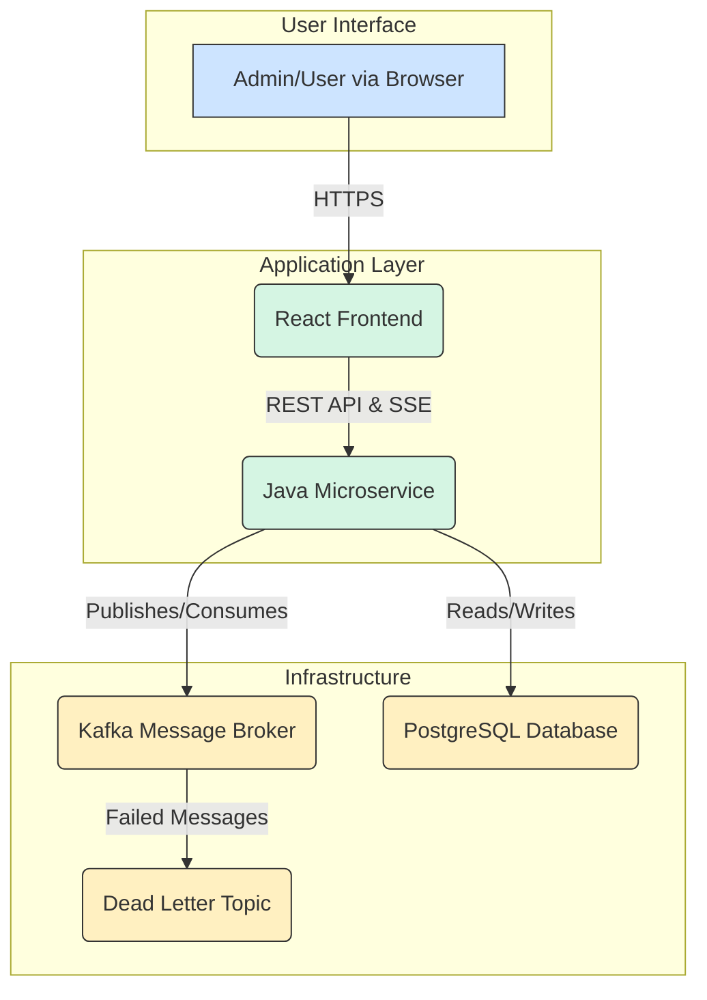

# Welcome to the Broadcast Messaging System Tutorial

This tutorial provides a beginner-friendly guide to understanding the architecture and core concepts of the Broadcast Messaging System. We'll explore how the frontend, backend, and messaging queue work together to deliver real-time notifications.

## Project Architecture

The system is composed of a React frontend that communicates with a Java backend. The backend uses Kafka to manage message queues and ensures reliable, real-time delivery to users via Server-Sent Events (SSE).

Here is a high-level overview of the architecture:

## Chapters

Here is the path we'll take through the system. We recommend going in order, but feel free to jump to any topic that interests you.

1.  [High-Level System Architecture](01_system_architecture.md)
2.  [The React Frontend](02_react_frontend.md)
3.  [The Java Microservice](03_java_microservice.md)
4.  [Real-time Magic: Server-Sent Events (SSE)](04_server_sent_events.md)
5.  [The Backbone: Kafka Integration](05_kafka_integration.md)
6.  [Handling Failure: DLT Management](06_dlt_management.md)
7.  [Caching Integration](07_caching_integration.md)
--- END OF FILE ---
