# Broadcast Microservice Documentation

## Overview
This documentation provides a comprehensive overview of the Broadcast Microservice, a high-throughput, real-time notification system designed to deliver messages to a large number of users efficiently. The system leverages modern technologies like Spring Boot WebFlux, Kafka, Server-Sent Events (SSE), and Redis for caching and distributed messaging.

## Architecture
The Broadcast Microservice follows a reactive and event-driven architecture. Key components include:

- **React Frontend (A)**: User interface for managing and receiving broadcasts.
- **Spring Boot WebFlux Microservice (C)**: Backend service handling business logic, API endpoints, and integration with other components.
- **Kafka (D)**: Distributed streaming platform for reliable, high-throughput message ingestion and processing.
- **Redis Cache (G)**: In-memory data store used for caching user connections, pending messages, and broadcast content to improve performance and reduce database load.
- **PostgreSQL (E)**: Relational database for persistent storage of broadcast information and user data.
- **Caffeine Cache (F)**: In-memory cache for frequently accessed data within the microservice.

```mermaid
graph TD
    A[React Frontend] -->|1. Send Broadcast Request| B(Load Balancer)
    B -->|2. Route Request| C{Java Microservice}
    C -->|3. Publish Event| D[Kafka]
    D -->|4. Consume Event| C
    C -->|5. Store Data| E[PostgreSQL]
    C -->|6. Cache Data| F[Caffeine Cache]
    C -->|7. Cache Data| G[Redis Cache]
    C -->|8. Deliver via SSE| A

    subgraph Infrastructure
        D
        E
        G
    end

    style A fill:#f9f,stroke:#333,stroke-width:2px
    style B fill:#bbf,stroke:#333,stroke-width:2px
    style C fill:#bfb,stroke:#333,stroke-width:2px
    style D fill:#ffb,stroke:#333,stroke-width:2px
    style E fill:#ccf,stroke:#333,stroke-width:2px
    style F fill:#fbc,stroke:#333,stroke-width:2px
    style G fill:#fbc,stroke:#333,stroke-width:2px
```

## Table of Contents
1. [System Architecture](01_system_architecture.md)
2. [React Frontend](02_react_frontend.md)
3. [Java Microservice](03_java_microservice.md)
4. [User Session Management](04_user_session_management.md)
5. [Server-Sent Events (SSE)](05_server_sent_events.md)
6. [Kafka Integration](06_kafka_integration.md)
7. [DLT Management](07_dlt_management.md)
8. [Caching System Integration](08_caching_integration.md)
9. [Database Integration](09_database_integration.md)
10. [Scheduler Management and Flows](10_scheduler_flow.md)
11. [Deployment](11_deployment.md)
12. [Troubleshooting](12_troubleshooting.md)
13. [Future Enhancements](13_future_enhancements.md)

